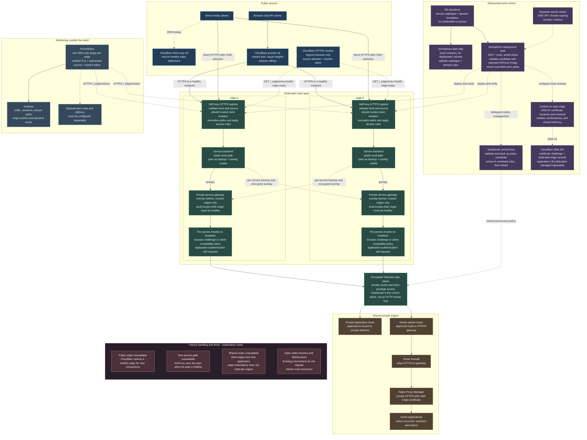

# Infrastructure overview

Generic documentation: no real service inventory, node names or private addresses.

```mermaid
flowchart TB
    subgraph PUBLIC["Public access"]
        direction LR
        WEB["Browser and API clients"]
        MEDIA["Direct media clients"]
        DNS["Cloudflare DNS-only LB<br/>returns healthy edge addresses"]
        CF["Cloudflare proxied LB<br/>shared pool, equal weights<br/>session affinity"]
        PROBE["Cloudflare HTTPS monitor<br/>ingress liveness only<br/>source allowlist + monitor token"]
        WEB --> CF
        MEDIA -. "DNS lookup" .-> DNS
    end

    subgraph EDGES["Dedicated entry layer"]
        direction LR
        subgraph EDGEA["edge-a"]
            direction TB
            HA["HAProxy HTTPS ingress<br/>validate Host and source<br/>rebuild trusted client headers<br/>normalize paths and apply access rules"]
            SELECTA["Service backend<br/>prefer local path<br/>peer as backup + routing cookie"]
            GWA["Private service gateway<br/>overlay listener, trusted edges only<br/>local Anubis AND origin must be healthy"]
            ANA["Per-service Anubis on loopback<br/>browser challenge or client-compatible policy<br/>application authentication still required"]
            HA --> SELECTA
            SELECTA -->|"primary"| GWA
            GWA --> ANA
        end
        subgraph EDGEB["edge-b"]
            direction TB
            HB["HAProxy HTTPS ingress<br/>validate Host and source<br/>rebuild trusted client headers<br/>normalize paths and apply access rules"]
            SELECTB["Service backend<br/>prefer local path<br/>peer as backup + routing cookie"]
            GWB["Private service gateway<br/>overlay listener, trusted edges only<br/>local Anubis AND origin must be healthy"]
            ANB["Per-service Anubis on loopback<br/>browser challenge or client-compatible policy<br/>application authentication still required"]
            HB --> SELECTB
            SELECTB -->|"primary"| GWB
            GWB --> ANB
        end
        SELECTA -. "per-service backup over encrypted overlay" .-> GWB
        SELECTB -. "per-service backup over encrypted overlay" .-> GWA
    end

    CF -->|"HTTPS to a healthy endpoint"| HA
    CF -->|"HTTPS to a healthy endpoint"| HB
    MEDIA -->|"direct HTTPS after DNS selection"| HA
    MEDIA -->|"direct HTTPS after DNS selection"| HB
    PROBE -. "GET /_edge/entry-health: edge-ready" .-> HA
    PROBE -. "GET /_edge/entry-health: edge-ready" .-> HB

    MESH["Encrypted Tailscale data plane<br/>private routes and least-privilege access<br/>Headscale is the control plane, not an HTTP transit hop"]
    ANA --> MESH
    ANB --> MESH

    subgraph ORIGINS["Shared private origins"]
        direction LR
        VPS["Private application hosts<br/>applications bound to private listeners"]
        ROUTER["Home subnet router<br/>approved route to HTTPS gateway"]
        FW["Home firewall<br/>allow HTTPS to gateway"]
        NPM["Nginx Proxy Manager<br/>private HTTPS with valid origin certificate"]
        APPS["Home applications<br/>native accounts, sessions and tokens"]
        ROUTER --> FW --> NPM --> APPS
    end
    MESH --> VPS
    MESH --> ROUTER

    subgraph OPS["Deployment and control"]
        direction LR
        GIT["Git repository<br/>service catalogue + generic templates<br/>no credentials in source"]
        PLAN["Semaphore plan task<br/>local inventory, no deployment secrets<br/>validate catalogue + derived rules"]
        DEPLOY["Semaphore deployment task<br/>SSH + sudo, serial rollout<br/>validate candidate with selected HAProxy image<br/>check local AND peer paths"]
        SECRETS["Separate secret values<br/>DNS API / Anubis signing<br/>monitor / metrics"]
        HS["Headscale control host<br/>validate and back up policy candidate<br/>preserve unrelated rules, then reload"]
        CERT["Certbot on each edge<br/>DNS-01 certificate issuance and renewal<br/>validate certificate/key and reload HAProxy"]
        CFAPI["Cloudflare DNS API<br/>certificate challenge + dedicated edge records<br/>application LB publication managed separately"]
        GIT --> PLAN
        GIT --> DEPLOY
        SECRETS -.-> DEPLOY
        DEPLOY -. "delegated policy management" .-> HS
        DEPLOY -. "configure local renewal" .-> CERT
        CERT -. "DNS-01" .-> CFAPI
    end

    DEPLOY -. "deploy and verify" .-> HA
    DEPLOY -. "deploy and verify" .-> HB
    HS -. "control and access policy" .-> MESH

    subgraph MONITORING["Monitoring outside the mesh"]
        direction LR
        PROM["Prometheus<br/>one DNS-only target per edge<br/>verified TLS + authorized source + metrics token"]
        GRAF["Grafana<br/>traffic, sessions, service paths<br/>origin probes and backend errors"]
        ALERT["Optional alert rules and delivery<br/>must be configured separately"]
        PROM --> GRAF
        PROM -.-> ALERT
    end
    PROM -. "HTTPS /_edge/metrics" .-> HA
    PROM -. "HTTPS /_edge/metrics" .-> HB

    subgraph BOUNDARIES["Failure handling and limits - explanatory notes"]
        direction LR
        LIMIT_EDGE["Public edge unavailable<br/>Cloudflare selects a healthy edge for new connections"]
        LIMIT_PATH["One service path unavailable<br/>HAProxy uses the peer when its path is healthy"]
        LIMIT_ORIGIN["Shared origin unavailable<br/>Both edges lose that application<br/>edge redundancy does not replicate origins"]
        LIMIT_STREAM["Open video streams and WebSockets<br/>Existing connections do not migrate<br/>clients must reconnect"]
        LIMIT_EDGE ~~~ LIMIT_PATH ~~~ LIMIT_ORIGIN ~~~ LIMIT_STREAM
    end

    %% Invisible positioning only: this is not a data-flow connection.
    ORIGINS ~~~ BOUNDARIES

    classDef public fill:#233d58,stroke:#7ab5dc,color:#f2f6ff
    classDef edge fill:#284c44,stroke:#7bc8a7,color:#f2f6ff
    classDef origin fill:#514132,stroke:#d6b48c,color:#f2f6ff
    classDef ops fill:#43395c,stroke:#b4a0de,color:#f2f6ff
    classDef monitor fill:#34495b,stroke:#9bbdd4,color:#f2f6ff
    classDef note fill:#4c303a,stroke:#dd9ba7,color:#fff5f6
    class WEB,MEDIA,DNS,CF,PROBE public
    class HA,HB,SELECTA,SELECTB,GWA,GWB,ANA,ANB,MESH edge
    class VPS,ROUTER,FW,NPM,APPS origin
    class GIT,PLAN,DEPLOY,SECRETS,HS,CERT,CFAPI ops
    class PROM,GRAF,ALERT monitor
    class LIMIT_EDGE,LIMIT_PATH,LIMIT_ORIGIN,LIMIT_STREAM note
    style BOUNDARIES fill:#291f2a,stroke:#dd9ba7,color:#fff5f6
```
