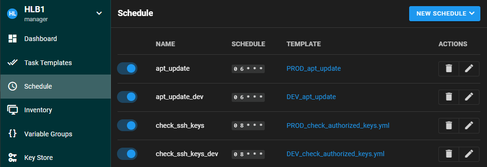
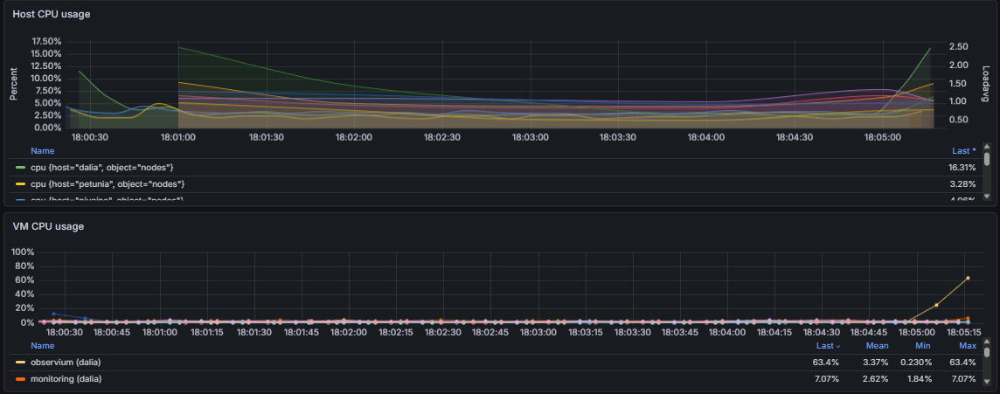
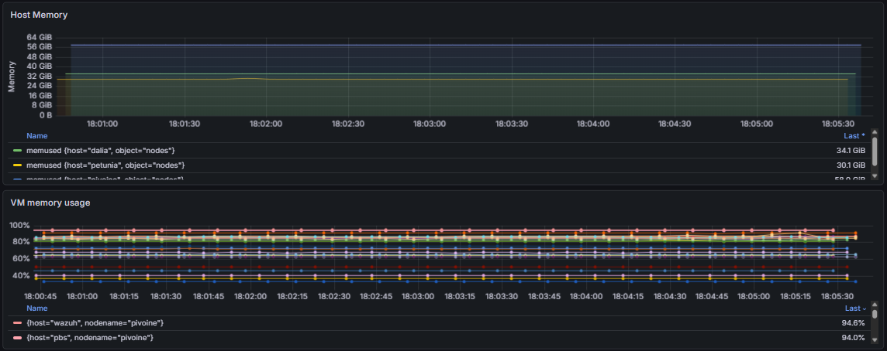
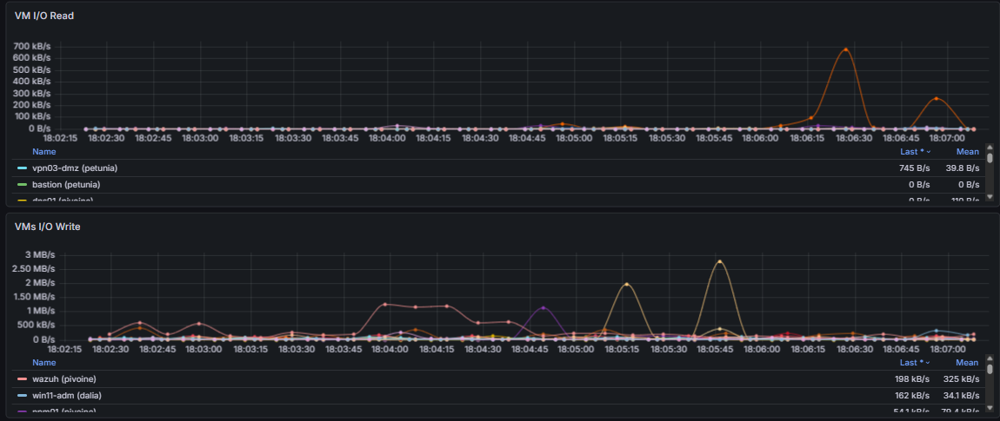
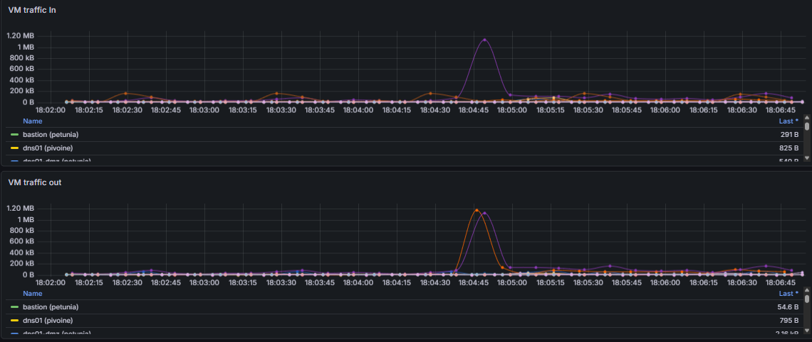
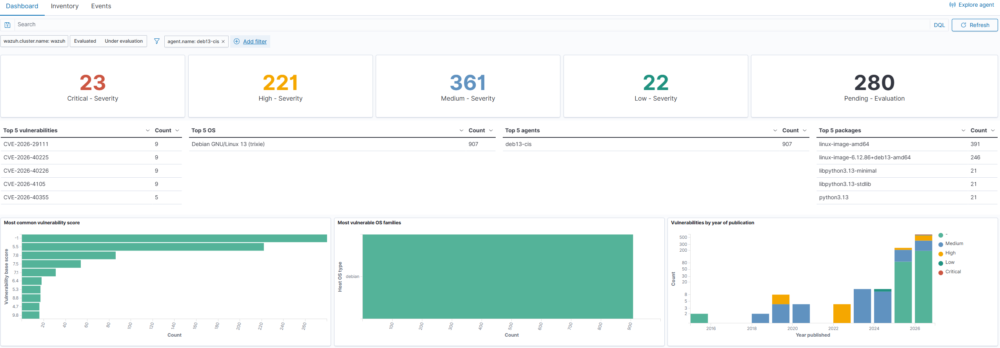
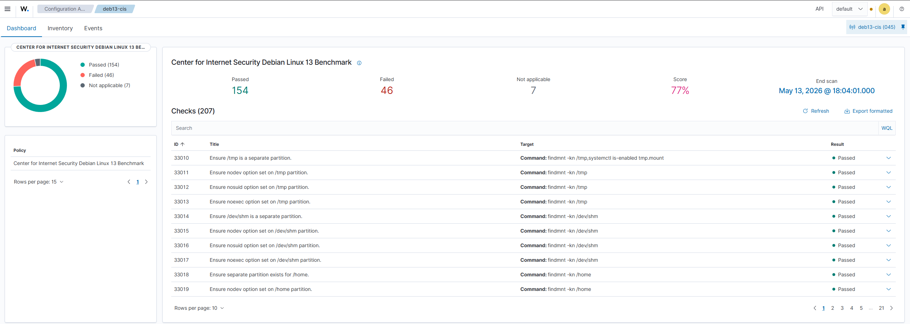

<h2>Welcome back to the homegarden</h2>

So you came back. Either WIMH #1 didn't scare you off, or you're the kind of person who reads an open-house post and thinks "yeah but I want more". Good news : that's exactly what this one is.

Last time I gave you <a href="https://blog.interlope.xyz/my-homelab-setup">the tour</a> : the rack, the three proxmox servers, the OpenFabric mesh, the VLAN map, the zone firewall, and a wave at the ~40 VMs doing the heavy work. It was a <em>tour</em>. You looked, you nodded, you moved on. This time I'm cornering you next to the rack and I'm not letting you leave until you've heard about my NTP setup. All of it.

So same deal as last time : grab the coffee pot, this one's long too. We're going service by service through the stuff #1 only pointed at : the Tailscale mesh, the HA that keeps the flowers(proxmox servers) alive when one of them faints, the backups, the storage move I did because I read one sentence on the internet and had some free time, the whole GitOps spine, the monitoring, the security, the DNS, the cloud, and yes, the time servers.

Same disclaimer as always : this is a <strong>homelab</strong>. The <em>not-so-home-but-more-like-prod-lab</em>. Nothing here is a reference architecture. Some of it is genuinely solid, some of it is held together by a daily cron, some prayers at night, a lot of good intentions, and at least one decision in here was made because of a single forum post I will never find again. That's the fun. That's the spirit.

Let's crack this 24U open once again lads.
 

<h2>The overlay : Tailscale</h2>

In WIMH #1 I said the VPN zone was "a little more elaborate than install Tailscale, done". Here's the elaborate part.

Even though this is a homelab and I could self-host this one, I'm on the <strong>official Tailscale control plane</strong>, not Headscale. I like the Tailscale UI/UX, but I don't love handing <em>all</em> of the trust to someone else's control plane, so the first thing I run is my own pair of <strong>tailnet-lock signing nodes</strong>.

<blockquote>

[!NOTE]
<strong>Tailnet lock</strong>, quickly : normally Tailscale's control plane can add a node to your tailnet and that node is trusted without any verification. Tailnet lock flips that, new nodes have to be <strong>cryptographically signed by a key <em>you</em> hold</strong> before anyone trusts them. So even if the control plane were compromised, nobody can silently join my network. I run <strong>two</strong> signing nodes so losing one doesn't lock me out of ever adding a machine again. It's the one place I currently refuse to fully outsource trust. 

</blockquote>

On top of that I run four Tailscale nodes, and the whole point is that each one is a <em>different trust posture</em>. Keeping them as separate machines means I never have to stop and ask "wait, what's this connection allowed to do".

<h3>vpn01 - the exit node</h3>

<code>vpn01</code> advertises itself as an <strong>exit node</strong> (<code>tailscale up --advertise-exit-node</code>). When a device picks it, <em>all</em> of that device's traffic comes home and leaves through my edge : my IDS/IPS, my geoblocking, my rules. On top of that, the tailnet DNS config hands clients my <strong>production Pi-hole</strong> as resolver and <strong>MagicDNS</strong> for the <code>*.ts.net</code> names. So when I'm on hostile wifi in some airport or some hotel, my phone is effectively sitting on my couch : adblocked, filtered, and resolving like it's home.

<h3>vpn02 - the bastion node</h3>

<code>vpn02</code> is the one I actually use the most, and it's the opposite philosophy. It advertises <strong>specific subnet routes</strong> (<code>--advertise-routes=...</code>) for the internal ranges I want to reach like my ssh bastion or my windows vm box, but it <strong>does not advertise an exit node</strong> and hands out <strong>no DNS</strong>. So when I connect through it everything else except my ssh session to my bastion on my laptop stays local and normal.

That's the "I just need access into the lab, not to route my entire life through my house" node. I'm fixing a service from a café, I don't want my Netflix going through my home uplink and I don't want my browsing resolved by my Pi-hole logs. <code>vpn02</code> gives me the lab and nothing else.

<h3>vpn03 - the family node</h3>

<code>vpn03</code> is the same idea as <code>vpn01</code> (full tunnel, DNS handed out) <strong>but its egress is pushed through the DMZ</strong> instead of the trusted internals. The household gets a clean, adblocked, geofenced, IDS-protected internet pipe... without ever getting a door into the good stuff. They get the <em>benefits</em> of the lab without being <em>in</em> the lab. Everyone's happy, nobody's a lateral-movement risk.

<h3>vpn04 - the VPS entry node</h3>

<code>vpn04</code> is the bridge from the outside world <em>into</em> the lab. My external VPS joins the tailnet through it, which means public services don't need a single port forwarded on my home connection. The VPS is the only thing with a public face ; it terminates the inbound traffic and forwards it over the tailnet to my internal services. The lab exposes itself to the internet <strong>on my terms only</strong>, through one machine I can nuke and rebuild without touching home.

Four nodes, four postures. Overkill ? Maybe. But I never have to think about which policy a connection is under, and that's worth a few extra VMs. Also they're not even using 256MB of RAM which is kinda okay...

<pre><code class="language-tabs">[vpn01 status]
ansible@vpn01-https:~$ tailscale status
100.106.171.50   vpn01-https   vpn01-https.pirate-pirarucu.ts.net  linux    idle; offers exit node                      
100.106.159.1    ts-sign01     interlope@                          linux    -                                           
100.115.155.43   ts-sign02     interlope@                          linux    -   
# vpn01 advertising: exit node ; accepting routes: no

[vpn02 routes]
ansible@vpn02-nodns:~$  tailscale status --json | jq -r '.Self.PrimaryRoutes[]?'
x.y.z.1/32 # ssh bastion
x.y.z.2/32 # rdp bastion
# no exit node advertised, no DNS handed out

[vpn03 status]
ansible@vpn01-https:~$ tailscale status
100.75.255.93    vpn03-dmz     vpn03-dmz.pirate-pirarucu.ts.net  linux    idle; offers exit node                      
100.106.159.1    ts-sign01     interlope@                          linux    -                                           
100.115.155.43   ts-sign02     interlope@                          linux    -   
# vpn01 advertising: exit node ; accepting routes: no

[vpn04 netcheck]
ansible@vpn04-vps:~$ tailscale netcheck
2026/06/08 14:54:39 portmap: monitor: gateway and self IP changed: gw=x.y.z.1 self=x.y.z.2

Report:
        * Time: 2026-06-08T12:54:39.630313297Z
        * UDP: true
        * IPv4: yes, @homeip:48169
        * IPv6: no, but OS has support
        * MappingVariesByDestIP: false
        * PortMapping:
        * Nearest DERP: Paris
        * DERP latency:
                - par: 14.8ms  (Paris)
                - lhr: 21.1ms  (London)
                - ams: 22.3ms  (Amsterdam)
                - mad: 22.4ms  (Madrid)
                - fra: 22.8ms  (Frankfurt)
                - nue: 25ms    (Nuremberg)
                - waw: 41.8ms  (Warsaw)
                - hel: 48.2ms  (Helsinki)
                - nyc: 84.8ms  (New York City)
                - iad: 97ms    (Ashburn)
                - dbi: 101.1ms (Dubai)
                - tor: 103.5ms (Toronto)
                - ord: 107.3ms (Chicago)
                - mia: 116.5ms (Miami)
                - dfw: 126ms   (Dallas)
                - den: 129.3ms (Denver)
                - blr: 129.5ms (Bengaluru)
                - sfo: 153.3ms (San Francisco)
                - lax: 154ms   (Los Angeles)
                - sea: 154.4ms (Seattle)
                - nai: 176.8ms (Nairobi)
                - jnb: 181.2ms (Johannesburg)
                - hkg: 186.2ms (Hong Kong)
                - hnl: 201.2ms (Honolulu)
                - tok: 236.2ms (Tokyo)
                - sin: 236.6ms (Singapore)
                - sao: 244.3ms (São Paulo)
                - syd:         (Sydney)</code></pre>
<blockquote>

[!IMPORTANT]
You'll notice I'm <strong>not publishing my ACL file</strong>. It's a full map of who-can-reach-what-and-how, which is exactly the kind of free metadata I <a href="https://blog.interlope.xyz/how-to-evade-your-isp">refuse to hand out</a>. The mechanism above is the interesting part anyway. The policy is just plumbing. Mario here we go.

</blockquote>
<h2>Keeping the flowers alive : Proxmox HA</h2>

A three-node cluster is only worth the trouble if losing a node is a non-event. So <strong>every VM in the lab is HA-managed</strong>. Not just the important ones, all of them. If a flower faints, <code>ha-manager</code> notices, picks a surviving node, and restarts the guests there. I lose a few seconds to a couple of minutes depending on the VM, and then life goes on.

But HA without <strong>fencing</strong> is a footgun. Fencing is the guarantee that a VM is never accidentally running in <em>two</em> places at once (split-brain), which is the kind of hassle you never, never, never ever want to fix. The way Proxmox does this : a node that loses quorum <strong>fences itself</strong>. I'm using the <strong>integrated softdog watchdog</strong>, so a node that falls out of the cluster gets rebooted by its own watchdog after the timeout, and only <em>then</em> are its VMs considered safe to restart elsewhere.

<blockquote>

[!WARNING]
Software watchdog self-fencing means that when a node loses the cluster, it <strong>reboots itself</strong>, on purpose. The first time you watch a node spontaneously reboot because a cable was flaky, it feels like a bug. It's not. It's fencing doing exactly its job. The "proper" upgrade is a hardware watchdog / IPMI / external KVM, which is why those <strong>GL.iNet Comet</strong> KVMs are on my roadmap. Until then, softdog it is, and it works.

</blockquote>
<h3>Affinity rules : never lose both halves of a pair</h3>

Here's the part I actually like. A lot of my redundancy comes in <strong>pairs</strong> : two NTP servers, two Pi-holes, two VPN signing nodes, the pgs master/replica, the bastions. The whole point of a pair is that you never lose both at once, and HA can absolutely ruin that by cheerfully scheduling both halves onto the same node.

Proxmox VE 9's <strong>HA rules</strong> fix this with <strong>resource anti-affinity</strong>. I tell the cluster "these two must stay apart" and it keeps them on different nodes :

<pre><code class="language-tabs">[negative]
root@pivoine:~# cat /etc/pve/ha/rules.cfg
resource-affinity: ha-rule-edb41a5a-07c9
        affinity negative
        resources vm:20053,vm:25053

resource-affinity: ha-rule-510b4ed2-5327
        affinity negative
        resources vm:5041,vm:5042

resource-affinity: ha-rule-b30cce55-54ef
        affinity negative
        resources vm:20123,vm:20124

resource-affinity: ha-rule-637499e6-342b
        affinity negative
        resources vm:20032,vm:20033

resource-affinity: ha-rule-4e63e971-aff9
        affinity negative
        resources vm:25053,vm:25123

[pivoine]
node-affinity: ha-rule-3f954afc-7623
        comment pivoine
        nodes pivoine
        resources vm:20033,vm:20042,vm:20049,vm:20053,vm:20057,vm:20080,vm:25123,vm:30207,vm:5041,vm:5046
        strict 0

[petunia]
node-affinity: ha-rule-4f0edd54-5473
        comment petunia
        nodes petunia
        resources vm:20022,vm:20032,vm:20039,vm:20046,vm:20124,vm:20199,vm:25053,vm:5045
        strict 0

[dalia]
node-affinity: ha-rule-69cd5b90-0d03
        comment dalia
        nodes dalia
        resources vm:10010,vm:20023,vm:20040,vm:20041,vm:20048,vm:20123,vm:20200,vm:5042,vm:5044
        strict 0</code></pre>

So even in the worst case, a single node dying, I never lose <em>both</em> DNS resolvers, <em>both</em> time servers, or my Postgres master and replica together. One half always survives somewhere else.

<pre><code class="language-tabs">[ha-manager status]
root@pivoine:~# ha-manager status
quorum OK
master petunia (active, Mon Jun  8 15:30:58 2026)
fencing armed (CRM watchdog active)
lrm dalia (active, watchdog active, Mon Jun  8 15:31:01 2026)
lrm petunia (active, watchdog active, Mon Jun  8 15:30:52 2026)
lrm pivoine (active, watchdog active, Mon Jun  8 15:30:58 2026)
service vm:10010 (dalia, started)
service vm:15112 (pivoine, started)
service vm:20022 (petunia, started)
service vm:20023 (dalia, started)
service vm:20032 (petunia, started)
service vm:20033 (pivoine, started)
service vm:20039 (petunia, started)
service vm:20040 (dalia, started)
service vm:20041 (dalia, started)
service vm:20042 (pivoine, started)
service vm:20046 (petunia, started)
service vm:20048 (dalia, started)
service vm:20049 (pivoine, started)
service vm:20053 (pivoine, started)
service vm:20057 (pivoine, started)
service vm:20059 (pivoine, started)
service vm:20080 (pivoine, started)
service vm:20123 (dalia, started)
service vm:20124 (petunia, started)
service vm:20199 (petunia, started)
service vm:20200 (dalia, started)
service vm:25053 (petunia, started)
service vm:25123 (pivoine, started)
service vm:25198 (pivoine, started)
service vm:30207 (pivoine, started)
service vm:5041 (pivoine, started)
service vm:5042 (dalia, started)
service vm:5043 (pivoine, started)
service vm:5044 (dalia, started)
service vm:5045 (petunia, started)
service vm:5046 (pivoine, started)

[a bit of tuning]
# CPU type passed straight through, no emulation tax
root@pivoine:~# grep -m1 cpu /etc/pve/qemu-server/20053.conf
cpu: host

# migrations ride the dedicated cluster network, not the public one
root@pivoine:/home/interlope# cat /etc/pve/datacenter.cfg

crs: ha-rebalance-on-start=1
max_workers: 6
migration: secure,network=10.100.3.101/24
replication: secure,network=10.100.3.101/24
tag-style: ordering=alphabetical,shape=full</code></pre>

Is "HA on literally everything" overkill for a homelab ? Probably. But the cluster has the cores and RAM for it, the migrations are clean over the 10G SFP+ cephfs network, and it means the answer to "what happens if a node dies" is "I find out from a dashboard the next morning" instead of "I find out from a few services being down".
 

<h2>The backups, deeper : PBS + Proxmox</h2>

The first WIMH covered the <strong>3-2-1</strong> story (Ceph → PBS-on-NAS → S3 offsite + the dumb external HDD on my desk). Here's what's actually happening <em>inside</em> PBS.

The datastore lives on the TrueNAS box, mounted over NFS (more on <em>that</em> migration in the next section), and Proxmox talks to it as a first-class storage backend :

<pre><code class="language-tabs">[datastore]
root@hortensia:~# proxmox-backup-manager datastore list
┌──────────────┬─────────────────────────┬─────────┐
│ name         │ path                    │ comment │
╞══════════════╪═════════════════════════╪═════════╡
│ bu-pbs-hlb1  │ xyz                     │   s3    │
├──────────────┼─────────────────────────┼─────────┤
│ nas01-dtst01 │ xyz                     │         │
├──────────────┼─────────────────────────┼─────────┤
│ nas01-dtst02 │ xyz                     │         │
└──────────────┴─────────────────────────┴─────────┘

[schedules]
root@hortensia:~# proxmox-backup-manager datastore show nas01-dtst01
┌───────────────────┬─────────────────────────┐
│ Name              │ Value                   │
╞═══════════════════╪═════════════════════════╡
│ name              │ nas01-dtst01            │
├───────────────────┼─────────────────────────┤
│ path              │ xyz                     │
├───────────────────┼─────────────────────────┤
│ comment           │                         │
├───────────────────┼─────────────────────────┤
│ gc-schedule       │ 7:00                    │
├───────────────────┼─────────────────────────┤
│ notification-mode │ notification-system     │
├───────────────────┼─────────────────────────┤
│ verify-new        │ 1                       │
└───────────────────┴─────────────────────────┘
root@hortensia:~# proxmox-backup-manager prune-job list
┌──────────────────────────────────┬─────────┬──────────────┬────┬───────────┬───────────┬───────────┬─────────────┬────────────┬─────────────┬──────────────┬─────────────┐
│ id                               │ disable │ store        │ ns │ schedule  │ max-depth │ keep-last │ keep-hourly │ keep-daily │ keep-weekly │ keep-monthly │ keep-yearly │
╞══════════════════════════════════╪═════════╪══════════════╪════╪═══════════╪═══════════╪═══════════╪═════════════╪════════════╪═════════════╪══════════════╪═════════════╡
│ default-nas01-xzy                │         │ nas01-dtst01 │    │ 06:00     │           │         7 │             │            │             │              │             │
├──────────────────────────────────┼─────────┼──────────────┼────┼───────────┼───────────┼───────────┼─────────────┼────────────┼─────────────┼──────────────┼─────────────┤
│ default-nas01-xyz                │         │ nas01-dtst02 │    │ thu 06:30 │           │        30 │             │            │             │              │             │
└──────────────────────────────────┴─────────┴──────────────┴────┴───────────┴───────────┴───────────┴─────────────┴────────────┴─────────────┴──────────────┴─────────────┘
root@hortensia:~# proxmox-backup-manager sync list
┌─────────────────┬────────────────┬──────────────┬────────┬──────────────┬───────────┬──────────────┬─────────┬─────────┐
│ id              │ sync-direction │ store        │ remote │ remote-store │ schedule  │ group-filter │ rate-in │ comment │
╞═════════════════╪════════════════╪══════════════╪════════╪══════════════╪═══════════╪══════════════╪═════════╪═════════╡
│ s-00793c6e-xyz  │                │ nas01-dtst02 │        │ nas01-dtst01 │ mon 08:00 │ all          │         │         │
└─────────────────┴────────────────┴──────────────┴────────┴──────────────┴───────────┴──────────────┴─────────┴─────────┘
root@hortensia:~# proxmox-backup-manager verify-job list
┌─────────────────┬──────────────┬──────────┬─────────────────┬────────────────┬─────────┐
│ id              │ store        │ schedule │ ignore-verified │ outdated-after │ comment │
╞═════════════════╪══════════════╪══════════╪═════════════════╪════════════════╪═════════╡
│ v-4bd5e68f-xyz  │ nas01-dtst01 │ daily    │               1 │             30 │         │
├─────────────────┼──────────────┼──────────┼─────────────────┼────────────────┼─────────┤
│ v-f52d251a-xyz  │ nas01-dtst02 │ daily    │               1 │             30 │         │
└─────────────────┴──────────────┴──────────┴─────────────────┴────────────────┴─────────┘

[pvesm status]
root@pivoine:~# pvesm status | grep pbs
bu-pbs-hlb1          pbs   disabled               0               0               0      N/A
nas01-dtst01         pbs     active      2739830784       637783040      2102047744   23.28%
nas01-dtst02         pbs     active      2684354560      2025292800       659061760   75.45%</code></pre>

The two NAS datastores map straight onto the two-pool story from #1. <strong><code>nas01-dtst01</code></strong> is the fast landing zone : daily prune at <strong>06:00</strong> keeping the last <strong>7</strong> (a week worth of backup is enough for this pool)  followed by a daily GC at <strong>07:00</strong> and <code>verify-new</code> on so fresh backups get checked the moment they land. <strong><code>nas01-dtst02</code></strong> is the long-haul archive : a <strong>weekly</strong> prune (Thursday 06:30) keeping the last <strong>30</strong> (a month worth). Both run a <strong>daily verify</strong> job that re-reads chunks but skips anything already verified in the last 30 days (<code>ignore-verified</code> + <code>outdated-after 30</code>), so I'm not pointlessly re-hashing terabytes every night, just catching rot before it spreads. A backup you've never verified is a <em>hope</em>, not a backup.

The third datastore, <strong><code>bu-pbs-hlb1</code></strong> on <code>/mnt/datastore/cache-s3</code>, is the local cache for the S3 backend, the dedicated dataset PBS keeps so reads and restores don't hammer (and bill) the S3 API. It reads <strong>disabled</strong> in this capture, but that's not its resting state : I flip it on every few months to push a full offsite copy up to the bucket, then park it again. The daily grind is the local NAS copies ; the S3 run is the occasional "the whole house could burn down" insurance.

Encryption isn't just the offsite thing : <strong>everything PBS writes is encrypted client-side</strong> ; the local NAS datastores, the S3 copy, even the sync between the two datastores. Nothing, on the NAS or up in the cloud, ever sees plaintext. Same posture as everything else here : a third party (or a stolen NAS / disks) gets ciphertext or it gets nothing.

PBS deduplicates at the chunk level, so identical blocks across every snapshot and every VM get stored exactly once, which is why holding 7 (or 30) near-full snapshots doesn't swallow the NAS whole. The savings are frankly absurd : <code>nas01-dtst01</code> sits at a <strong>~20x</strong> dedup factor and <code>nas01-dtst02</code> at <strong>~28x</strong>, meaning each datastore is physically holding somewhere between a twentieth and a thirtieth of the logical data I've thrown at it.

<pre><code class="language-tabs">[nas01-dtst01]
root@hortensia:~# proxmox-backup-manager garbage-collection status nas01-dtst01 --output-format json | jq '."index-data-bytes" / ."disk-bytes"'
20.391607078048708

[nas01-dtst02]
root@hortensia:~# proxmox-backup-manager garbage-collection status nas01-dtst02 --output-format json | jq '."index-data-bytes" / ."disk-bytes"'
28.547859394301383</code></pre>
<blockquote>

[!TIP]
<strong>On the to-do list : namespaces.</strong> Right now everything dumps into one flat datastore. PBS <strong>namespaces</strong> let you carve a single datastore into isolated logical trees, so I could split backups <em>per zone</em> (internal / dmz / cluster) without building a separate datastore for each. Why bother ? Because namespaces get their own <strong>prune policies</strong> and their own <strong>ACLs</strong> : I could give a restricted token access to only the DMZ namespace, or keep DMZ snapshots on a shorter retention than production, all under one box. 
I don't do this <em>yet</em>. It's the kind of tidy-up that future-me will thank present-me for, and present-me hasn't gotten to it.

</blockquote>

 

<h2>The storage move : SMB → NFS</h2>

Time for the most honest section in this post.

I migrated my TrueNAS shares from <strong>SMB to NFS</strong> for one deeply scientific reason : <strong>I read somewhere on an obscure discord server that NFS is better than SMB for Linux-to-Linux.</strong> That's it. That's the rationale. No benchmark, no incident, no whitepaper. One sentence on the internet and a free Sunday.

Now, the funny part is that the sentence isn't entirely <em>wrong</em>. For Linux talking to Linux, NFSv4 is the more native fit : it's the protocol Linux was built around, it doesn't carry the Windows-flavoured chattiness and locking quirks of SMB, and for the big sequential reads/writes a PBS datastore does all night, it's a cleaner path. So I lucked into a reasonable decision for an unreasonable reason. I'll take it.

Here's the shape of it. The export is <strong>NFSv4.2</strong>, with <code>maproot</code> pinned (root on the client maps to root on the dataset, fixed user and group), and it's <strong>locked down to the backup VLAN and the PBS host specifically</strong> so nothing else on the network can even see it.

<pre><code>root@hortensia:~# grep nas01 /etc/fstab
@nasip:/xyz/nas01-dtst01  /xyz/nas01-dtst01  nfs  rw,relatime,hard,_netdev,nofail,vers=4.2  0  0
@nasip:/xyz/nas01-dtst02  /xyz/nas01-dtst02  nfs  rw,relatime,hard,_netdev,nofail,vers=4.2  0  0</code></pre>
<blockquote>

[!TIP]
The mount-option gotcha that'll cost you an evening : <strong><code>_netdev</code></strong>. Without it, systemd will happily try to mount the NFS share <em>before</em> the network is up, the mount fails, and PBS comes up pointing at an empty directory thinking your datastore vanished. <code>_netdev</code> tells it "wait for the network". Also use <strong><code>hard</code></strong> and not <code>soft</code> for a backup target, you want I/O to <em>block and retry</em> if the NAS hiccups, not silently return errors into the middle of a backup.

</blockquote>

Did I benchmark before and after ? No, of course I didn't, that would have implied I had a real reason to migrate. It <em>feels</em> snappier, the stale-handle weirdness I used to get on SMB is gone, and PBS is happy. For a change made on vibes, that's a clean result.
 

<h2>The semi GitOps spine</h2>

This is the brain that keeps the fleet consistent. <strong>Gitea</strong> is the source of truth, <strong>Semaphore</strong> is the hands.

Semaphore pulls its <strong>Ansible inventory straight out of Gitea</strong>, and I keep <strong>two inventories</strong> : <code>dev</code> and <code>prod</code>. Same playbooks, different targets, so I can break something on dev without explaining to myself later why prod is on fire. Semaphore authenticates to Gitea and to every host with its <strong>own dedicated SSH key</strong>, scoped for exactly that, which is also why the firewall has those surgical management exceptions I mentioned in #1.

In WIMH #1 I showed the whole playbook tree (the <code>apt</code> / <code>security</code> / <code>utilities</code> / <code>ntp</code> / <code>ssh</code> categories). I won't repeat it. Instead, here's a few of the workhorses that help me to run patch and configure some services :

<pre><code class="language-tabs">[apt update]
---
- name: Check for upgradable packages
  hosts: "{{ target_hosts }}"

  tasks:
    - name: Run apt update
      apt:
        update_cache: yes

    - name: Get list of upgradable packages
      command: "apt list --upgradable"
      register: upgradable_packages
      changed_when: false

    - name: Display upgradable packages
      debug:
        var: upgradable_packages.stdout_lines

[ssh config]
---
- name: Configuration sécurisée du service SSH
  hosts: "{{ target_hosts }}"
  become: yes

  tasks:
    - name: Supprimer toutes les anciennes clés hôtes SSH
      ansible.builtin.shell: rm -f /etc/ssh/ssh_host_*

    - name: Générer nouvelle clé RSA 4096 bits
      ansible.builtin.command: ssh-keygen -t rsa -b 4096 -f /etc/ssh/ssh_host_rsa_key -N ""

    - name: Générer nouvelle clé ED25519
      ansible.builtin.command: ssh-keygen -t ed25519 -f /etc/ssh/ssh_host_ed25519_key -N ""

    - name: Filtrer les moduli DH &gt;= 3071 bits
      shell: awk '$5 &gt;= 3071' /etc/ssh/moduli &gt; /etc/ssh/moduli.safe
      args:
        creates: /etc/ssh/moduli.safe

    - name: Remplacer le fichier moduli
      command: mv /etc/ssh/moduli.safe /etc/ssh/moduli
      args:
        removes: /etc/ssh/moduli.safe

    - name: Créer le répertoire sshd_config.d
      file:
        path: /etc/ssh/sshd_config.d
        state: directory
        mode: '0755'

    - name: Créer le fichier de durcissement ssh-audit
      copy:
        src: conf/ssh-audit_hardening.conf
        dest: /etc/ssh/sshd_config.d/ssh-audit_hardening.conf
        mode: '0644'
      notify: restart sshd

    - name: Déployer le fichier sshd_config principal
      template:
        src: conf/sshd_config
        dest: /etc/ssh/sshd_config
        mode: '0644'
        validate: /usr/sbin/sshd -t -f %s
      notify: restart sshd

    - name: Déployer /etc/issue
      template:
        src: conf/issue
        dest: /etc/issue
        mode: '0644'

    - name: Déployer /etc/issue.net
      template:
        src: conf/issue.net
        dest: /etc/issue.net
        mode: '0644'
      notify: restart sshd

  handlers:
    - name: restart sshd
      service:
        name: sshd
        state: restarted

[df]
---
- name: Get Disk Space Information
  hosts: "{{ target_hosts }}"
  become: true
  tasks:
    - name: Get all mounted filesystems
      shell: df -h
      register: df_full_output

    - name: Filter and display LVM volumes
      debug:
        msg: "{{ item }}"
      loop: "{{ df_full_output.stdout_lines | select('match', '^/dev/mapper/.*') | list }}"
      when: df_full_output.stdout_lines | select('match', '^/dev/mapper/.*') | list | length &gt; 0

    - name: Display servers without LVM volumes
      debug:
        msg: "⚠️  No LVM volumes found on {{ inventory_hostname }}"
      when: df_full_output.stdout_lines | select('match', '^/dev/mapper/.*') | list | length == 0

    - name: Check for disk space alerts (&gt;75%)
      debug:
        msg: "🚨 ALERT: {{ item.split()[0] }} is {{ item.split()[4] }} full on {{ inventory_hostname }}"
      loop: "{{ df_full_output.stdout_lines | select('match', '^/dev/mapper/.*') | list }}"
      when: 
        - df_full_output.stdout_lines | select('match', '^/dev/mapper/.*') | list | length &gt; 0
        - item.split()[4] | regex_replace('%', '') | int &gt; 75

    - name: Try to get LVM Volume Groups info (if available)
      shell: |
        if command -v vgs &gt;/dev/null 2&gt;&amp;1; then
          vgs --units h --nosuffix 2&gt;/dev/null || echo "No permissions for LVM commands"
        else
          echo "LVM tools not installed"
        fi        
      register: vg_output
      ignore_errors: yes
      changed_when: false

    - name: Display VG information if available
      debug:
        var: vg_output.stdout_lines
      when: 
        - vg_output.rc == 0
        - "'not installed' not in vg_output.stdout"
        - "'No permissions' not in vg_output.stdout"</code></pre>

Nothing clever, and that's the point. It's the difference between "is my fleet patched" being a question I can <em>answer</em> versus a thing I find out about during an incident. The <code>security</code> category is where the actual fun lives, the CVE patch playbooks for the bugs of the month, but the boring daily <code>apt</code> job is what keeps the whole garden from drifting.

<h2>The container fleet : Docker + Portainer</h2>

A big chunk of the actual <em>services</em> run in Docker, spread across <strong>eight hosts</strong>, each one a Proxmox VM with a Docker engine and a <strong>Portainer agent</strong>. One central <strong>Portainer</strong> UI sees all of them, so I manage the whole fleet from a single pane instead of SSH-hopping between boxes. I also manage them via ansible since they all are in the portainer category in my inventory :

<ul>
<li><strong>immich</strong> - self-hosted photos</li>
<li><strong>monitoring</strong> - Grafana / Prometheus / InfluxDB (its own section below)</li>
<li><strong>sso</strong> - Pocket-ID</li>
<li><strong>nextcloud</strong> - the personal cloud (its own section too)</li>
<li><strong>nginx</strong> - Nginx Proxy Manager, the front door for everything</li>
<li><strong>media</strong> - Jellyfin and friends</li>
<li><strong>hydracked</strong> - sits over in the <strong>DMZ</strong>, it's a little DB of film links, deliberately kept on the low-trust side</li>
<li><em>(and a guacamole host, currently parked)</em></li>
</ul>
<h3>How the compose files get backed up</h3>

Here's where I'll disappoint the GitOps purists. Portainer is only a <strong>monitoring pane</strong> for me, one place to eyeball every host's containers across the fleet, I don't deploy <em>through</em> it. The actual deploys are about as hand-rolled as it gets : I SSH in and <code>docker compose up -d</code> on each host like it's 2018. The compose files themselves are kept safe by a much dumber, much more reliable thing : a scheduled <strong>rsync</strong> of each host's stacks folder into a local working copy, then a <strong>git commit/push</strong> to Gitea. Each machine has its <strong>own branch</strong>, never merged, on the same repo, so the repo's branch list <em>is</em> my fleet :

<pre><code class="language-tabs">[branches]
interlope@immich:~/repo-docker-compose$ git branch -a
* immich
  main
  remotes/origin/HEAD -&gt; origin/main
  remotes/origin/guacamole
  remotes/origin/immich
  remotes/origin/main
  remotes/origin/media
  remotes/origin/monitoring
  remotes/origin/nginx
  remotes/origin/portainer
  remotes/origin/sso
    remotes/origin/hydracked

[tree]
interlope@immich:~/repo-docker-compose$ tree
.
├── immich-app
│   └── docker-compose.yml
└── watchtower
    └── docker-compose.yml
3 directories, 2 files

[rsync]
rsync -av \
  --exclude='*/*/' \
  --include='*/' \
  --include='docker-compose.yml' \
  --exclude='*' \
  --prune-empty-dirs \
  ~/docker/ ~/repo-docker-compose/
</code></pre>

You'll have spotted a <code>watchtower</code> stack in that tree, and it's on <strong>every</strong> Docker host. Watchtower (the actively-maintained <code>nickfedor</code> fork) keeps an eye on the running images and pings me through <strong>Gotify</strong> when a new version lands upstream, tagged per host via <code>WATCHTOWER_NOTIFICATION_TITLE_TAG</code> so I know <em>which</em> box is nagging me. The load-bearing knob is <strong><code>WATCHTOWER_MONITOR_ONLY=true</code></strong> : it watches and reports but does <em>not</em> pull and restart anything behind my back, because an unattended container silently updating itself at 3am is exactly the kind of surprise I built all those backups to survive. I get the nudge ; I pull the trigger myself.

<pre><code class="language-yaml">services:
  watchtower:
    image: nickfedor/watchtower
    restart: unless-stopped
    volumes:
      - /var/run/docker.sock:/var/run/docker.sock
      - /etc/timezone:/etc/timezone:ro
    environment:
      - WATCHTOWER_API_VERSION=1.44
      - WATCHTOWER_NOTIFICATION_TITLE_TAG=immich
      - WATCHTOWER_CLEANUP=true
      #- WATCHTOWER_LABEL_ENABLE=true
      - WATCHTOWER_INCLUDE_RESTARTING=true
      - WATCHTOWER_NOTIFICATIONS=gotify
      - WATCHTOWER_MONITOR_ONLY=true
      - WATCHTOWER_NOTIFICATION_GOTIFY_URL=https://gotify.xyz
      - WATCHTOWER_NOTIFICATION_GOTIFY_TOKEN=
    labels:
      - "com.centurylinklabs.watchtower.enable=true"</code></pre>
<h3>A compose worth showing : Immich</h3>

If I'm going to print one compose file, it's <strong>Immich</strong>, it's the one people actually want to see, and it's a nice example of a service that runs its <strong>own</strong> Postgres rather than leaning on my pgs pair : vector search needs the <strong>VectorChord</strong> + <strong>pgvecto.rs</strong> extensions, so Immich ships a purpose-built Postgres image, pinned by digest, naturally :

<pre><code class="language-yaml">name: immich
services:
  immich-server:
    container_name: immich_server
    image: ghcr.io/immich-app/immich-server:${IMMICH_VERSION:-release}
    # extends hwaccel.transcoding.yml for nvenc / quicksync / vaapi / rkmpp
    volumes:
      - ${UPLOAD_LOCATION}:/data
      - /etc/localtime:/etc/localtime:ro
    env_file:
      - .env
    ports:
      - '2283:2283'
    depends_on:
      - redis
      - database
    restart: always
    healthcheck:
      disable: false

  immich-machine-learning:
    container_name: immich_machine_learning
    # add -[cuda,rocm,openvino,armnn,rknn] to the tag for accelerated inference
    image: ghcr.io/immich-app/immich-machine-learning:${IMMICH_VERSION:-release}
    volumes:
      - model-cache:/cache
    env_file:
      - .env
    restart: always
    healthcheck:
      disable: false

  redis:
    container_name: immich_redis
    image: docker.io/valkey/valkey:9@sha256:fb8d272e529ea567b9bf1302245796f21a2672b8368ca3fcb938ac334e613c8f
    healthcheck:
      test: redis-cli ping || exit 1
    restart: always

  database:
    container_name: immich_postgres
    image: ghcr.io/immich-app/postgres:14-vectorchord0.4.3-pgvectors0.2.0@sha256:bcf63357191b76a916ae5eb93464d65c07511da41e3bf7a8416db519b40b1c23
    environment:
      POSTGRES_PASSWORD: ${DB_PASSWORD}
      POSTGRES_USER: ${DB_USERNAME}
      POSTGRES_DB: ${DB_DATABASE_NAME}
      POSTGRES_INITDB_ARGS: '--data-checksums'
    volumes:
      - ${DB_DATA_LOCATION}:/var/lib/postgresql/data
    shm_size: 128mb
    restart: always

volumes:
  model-cache:</code></pre>

As you can see, it exposes the usual ugly <code>host:2283</code>, which nobody ever actually types, because of the next piece.

<h2>The front door : Nginx Proxy Manager</h2>

I've said "behind NPM" about four times now, so let's open that door. Every clean hostname in the lab funnels through one <strong>Nginx Proxy Manager</strong> VM, <code>nginx.hlb1.xyz</code>, a Docker stack whose config lives on the <strong>pgs pair</strong> so a dead disk never takes my entire reverse-proxy map down with it.

The flow for any service is the same. I add a <strong>local CNAME in Pi-hole</strong>, say <code>immich.hlb1.xyz</code> → <code>nginx.hlb1.lan</code>. NPM holds a <strong>Let's Encrypt</strong> certificate for the domain, terminates TLS, and proxies the request through to the real backend, <code>immich.hlb1.lan:2283</code>. So the ugly <code>host:port</code> a compose file publishes never reaches a human : it becomes <code>https://immich.hlb1.xyz</code> with a proper green-padlock cert.

<pre><code class="language-tabs">[dns01]
interlope@immich:~$ nslookup immich.hlb1.xyz
Server:         10.100.20.53
Address:        10.100.20.53#53

immich.hlb1.xyz canonical name = nginx01.hlb1.lan.
Name:   nginx01.hlb1.lan
Address: 10.100.20.80

[internet]
interlope@immich:~$ nslookup
&gt; server 8.8.8.8
Default server: 8.8.8.8
Address: 8.8.8.8#53
&gt; immich.hlb1.xyz
Server:         8.8.8.8
Address:        8.8.8.8#53

** server can't find immich.hlb1.xyz: NXDOMAIN</code></pre>

Here's the part people usually get wrong about <code>hlb1.xyz</code> : it's a <strong>public domain, but none of these records live in public DNS</strong>. <code>immich.hlb1.xyz</code> exists <em>only</em> as a <strong>local record in my Pi-hole</strong>, so it resolves on the LAN and <strong>nowhere else</strong>, from the open internet the name is simply dead. The single reason I bother owning a public domain at all is to pass Let's Encrypt's <strong>DNS-01 challenge</strong> : the <code>_acme-challenge</code> TXT records go in the domain's real public zone, that's enough to prove I own <code>hlb1.xyz</code>, and Let's Encrypt hands me valid certs for hosts that were never meant to face outward. Public domain for the <em>cert</em>, private resolver for the <em>records</em>, no service ever actually exposed. That's the whole trick, and it's what turns a pile of containers on random ports into something that feels like a product.

<h2>Eyes everywhere : InfluxDB / Prometheus / Grafana</h2>

The monitoring host runs three things that, importantly, <strong>don't talk to each other</strong>. There are two completely independent metric pipelines, and <strong>Grafana</strong> just sits on top of both :

<ul>
<li><strong>InfluxDB</strong> is fed by <strong>Proxmox directly</strong>. PVE has a built-in external metric server, you point it at InfluxDB and the cluster ships its own host/VM metrics out of the box. This is the "how are the flowers doing" pipeline : CPU, RAM, IO, the cluster's vitals.</li>
<li><strong>Prometheus</strong> scrapes <strong>node_exporter</strong> on the fleet (plus a small <strong>OpenVPN collector</strong> I keep on my GitHub for the VPN-side metrics). This is the "how are the <em>machines</em> doing" pipeline, the classic exporter-and-scrape model. This is currently not used anymore since I switched from local OpenVPN to Tailscale. </li>
</ul>

There's no correspondence between the two, they're parallel, not layered. Influx gets the Proxmox-native firehose, Prometheus gets the exporter world, and Grafana is where I stitch them into dashboards I look at far too often.

<blockquote>

[!NOTE]
One thing I'll cop to : there's <strong>no alerting</strong> wired up. Gotify exists in the lab and yells at me about plenty of things, but Grafana isn't one of them. The dashboards are, if I'm honest, mostly <em>therapy</em>. I look at the graphs because they're pretty and they make me feel like I understand my own lab. That's a perfectly valid homelab use of a metrics stack and I won't be taking questions.

</blockquote>
<pre><code class="language-carousel">

</code></pre>
<h2>The watchtower : Wazuh</h2>

In #1 I called the Wazuh deployment "less paranoia and more therapy", and that's still true. It's a <strong>single-node All-in-One</strong> install : manager, indexer and dashboard on one box, with <strong>agents across essentially the whole fleet</strong>. For a lab my size, splitting the AIO into separate nodes would be effort for effort's sake.

What I actually lean on it for :

<ul>
<li><strong>FIM</strong> (file integrity monitoring) - something changes a file it shouldn't, I hear about it.</li>
<li><strong>rootcheck</strong> - the on-box rootkit/anomaly checks. This one's personal, after the <a href="https://blog.interlope.xyz/should-i-really-trust-my-binaries-rootkit-hunting-with-rkhunter">rabbit hole I went down on whether you can ever trust a compromised machine</a>, having centralized eyes on every box is the obvious follow-up.</li>
<li><strong>SCA</strong> (security configuration assessment) - the CIS-style policy checks. These pair directly with my <code>cis_harden.yml</code> Ansible playbook : harden with Ansible, then let Wazuh score how well it actually stuck. (see below for my debian 13 lab machine)</li>
<li><strong>CVE checks</strong> - Wazuh's vulnerability detection cross-references installed packages against known CVEs, so it'll flag a box running something with a published hole. Combined with the daily <code>apt</code> playbook, that's my "am I exposed to the bug of the week" answer.</li>
</ul>
<blockquote>

[!NOTE]
No, it doesn't feed Gotify. And yes, I will once again admit I don't read all of these logs. But the value isn't in reading them every day, it's in having them <em>already collected</em> on the day something actually goes wrong. Centralized history is the thing you can't generate retroactively. Maybe I'll look into it... Having Wazuh screaming at me may be fun.

</blockquote>
<pre><code class="language-carousel">

</code></pre>
<h2>Name resolution : Pi-hole ×2</h2>

Two Pi-holes, and unlike the NTP and PGS <em>pairs</em> on the cluster, these two are <strong>fully independent</strong> and serve different worlds :

<ul>
<li>the <strong>production / homelab resolver</strong> : the one the trusted network and my devices use.</li>
<li>the <strong>DMZ resolver</strong> : restricted and isolated, so a compromised DMZ box never gets to do lookups against the same resolver my house uses. Different zone, different resolver, different blast radius.</li>
</ul>

No sync between them, no gravity replication, on purpose. They're not redundant copies of each other, they're two deliberately separate trust domains that happen to run the same software.

Upstream, resolution leaves via <strong>DoH to Cloudflare</strong> (<code>cloudflared</code> doing the DNS-over-HTTPS hop), so my queries aren't going out in cleartext for my ISP to read. you may want to read the <a href="https://blog.interlope.xyz/how-to-evade-your-isp">post</a> i wrote about it.

<blockquote>

[!TIP]
The Pi-holes also do <strong>local resolution</strong> for the <code>*.hlb1.lan</code> names, so all those clean NPM hostnames actually resolve internally. Conditional forwarding / local DNS records are what turn <code>immich.hlb1.lan</code> from a nice idea into a thing your browser can find.

</blockquote>
<h2>The homelab GDrive : Nextcloud AIO</h2>

Nextcloud runs from the <strong>All-in-One</strong> docker-compose. AIO is its own beast : you don't run the individual containers yourself, you run a single <strong>mastercontainer</strong> that then spawns and manages all the siblings (Apache, the Nextcloud app, its database, Redis, and whatever optional bits you enable) through the Docker socket.

That means it brings its <strong>own bundled Postgres</strong>, it does <em>not</em> point at my pgs pair. Which is a little ironic given how much I evangelise that pair, but AIO is opinionated and fighting it isn't worth it. It lives behind NPM like everything else, with its data on the Ceph-backed VM disk.

<pre><code class="language-tabs">[containers]
interlope@nextcloud:~$ docker ps --format 'table {{.Names}}\t{{.Status}}'
NAMES                                STATUS
nextcloud-aio-mastercontainer        Up 9 days (healthy)
nextcloud-aio-apache                 Up 9 days (healthy)
nextcloud-aio-nextcloud              Up 9 days (healthy)
nextcloud-aio-notify-push            Up 9 days (healthy)
nextcloud-aio-database               Up 9 days (healthy)
nextcloud-aio-redis                  Up 9 days (healthy)
nextcloud-aio-collabora              Up 9 days (healthy)

[docker-compose.yml]
interlope@nextcloud:~/docker/nextcloud-aio$ cat docker-compose.yml
services:
  nextcloud-aio-mastercontainer:
    image: ghcr.io/nextcloud-releases/all-in-one:latest
    container_name: nextcloud-aio-mastercontainer
    init: true
    restart: always
    ports:
      - "8080:8080"
    volumes:
      - nextcloud_aio_mastercontainer:/mnt/docker-aio-config
      - /var/run/docker.sock:/var/run/docker.sock:ro
    environment:
      - NEXTCLOUD_DATADIR=/mnt/ncdata
      - APACHE_PORT=11000
      - APACHE_IP_BINDING=0.0.0.0
      - SKIP_DOMAIN_VALIDATION=true

volumes:
  nextcloud_aio_mastercontainer:
    name: nextcloud_aio_mastercontainer</code></pre>
<blockquote>

[!NOTE]
The mastercontainer pattern trips people up : if you go looking to <code>docker compose</code> your way around the inner containers, you'll fight AIO and lose. You manage it through the mastercontainer's interface, and you let it manage the rest. Once you accept that it's a controller and not a normal stack, it's genuinely low-maintenance.
 

</blockquote>
<h2>Keeping time : the NTP relais</h2>

Last one, and the one I warned you about. <a href="https://docs.ntpsec.org/latest/quick.html">Time matters</a> more than people think, a cluster with drifting clocks is a special kind of cursed to debug, so the lab runs a proper little <strong>NTP relais</strong> on <strong>ntpsec</strong>.

The topology is dead simple : <strong>internal clients → ntp01 / ntp02 → upstream</strong>. My two internal time servers sync from the Debian pool, and everything else in the lab syncs from <em>them</em>. Two of them, purely for redundancy, paired and kept on separate nodes by one of those HA anti-affinity rules from earlier, because the one thing you don't want a single point of failure on is <em>time</em>.

<pre><code class="language-conf"># pool.ntp.org maps to about 1000 low-stratum NTP servers.  Your server will
# pick a different set every time it starts up.  Please consider joining the
# pool: &lt;http://www.pool.ntp.org/join.html&gt;
server 0.debian.pool.ntp.org iburst
server 1.debian.pool.ntp.org iburst
server 2.debian.pool.ntp.org iburst
server 3.debian.pool.ntp.org iburst

# Access control configuration; see /usr/share/doc/ntp-doc/html/accopt.html for
# details.  The web page &lt;http://support.ntp.org/bin/view/Support/AccessRestrictions&gt;
# might also be helpful.
#
# Note that "restrict" applies to both servers and clients, so a configuration
# that might be intended to block requests from certain clients could also end
# up blocking replies from your own upstream servers.

# By default, exchange time with everybody, but don't allow configuration.
restrict -4 default kod notrap nomodify nopeer noquery limited

# Local users may interrogate the ntp server more closely.
restrict 127.0.0.1
restrict ::1

# but DO serve time to the internal VLANs
restrict 10.100.0.0 mask 255.255.0.0 nomodify notrap nopeer</code></pre>

And here's the relais actually working, from a regular client's point of view, syncing off <code>ntp01</code> / <code>ntp02</code> rather than reaching out to the internet itself :

<pre><code class="language-tabs">[client → ntp01/02]
ansible@bastion:~$ ntpq -p
     remote                                   refid      st t when poll reach   delay   offset   jitter
=======================================================================================================
*ntp01.hlb1.lan                          82.64.42.185     2 u   80 1024  377   0.6222  -0.6840   0.3288
+ntp02.hlb1.lan                          79.143.250.33    2 u 1062 1024  377   0.2333  -1.1489   0.7254

[ntp01 → upstream]
root@ntp01:~# ntpq -p
     remote           refid      st t when poll reach   delay   offset  jitter
==============================================================================
*time.cloudflare 10.21.8.19       3 u   42  256  377    6.122   0.118   0.241
+162.159.200.123 10.21.8.19       3 u   88  256  377    7.044  -0.205   0.318
+51.255.140.97   145.238.203.14   2 u  101  256  377    4.881   0.402   0.290
 213.251.128.249 .INIT.          16 u    -  256    0    0.000   0.000   0.000</code></pre>

The stratum-2 client is healthy, the <code>*</code> shows which peer it's actually disciplined to, and the internal hostnames in that <code>refid</code> column are the relais doing its job. Working, boring, redundant, and exactly what you want from time.
 

<h2>Putting it all together (again)</h2>

So that's the inside of the beasts. The mesh that lets me in four different ways depending on how much I trust the device in my hand. The HA that turns a dead node into a dashboard notification instead of an outage. The backups that verify themselves and leave the house encrypted. A storage migration I did on a rumour and got away with. A GitOps spine that's half best-practice and half rsync-and-pray. A container fleet under one pane of glass. Two metric pipelines feeding dashboards I stare at for fun, a watchtower I rarely read but am always glad to have, two resolvers in two trust domains, a personal cloud, and a pair of clocks keeping everyone honest.

None of it is finished. The namespaces aren't done, the KVMs aren't bought, the alerting isn't wired, and at least one design decision in here was load-bearing <em>vibes</em>. That's still the whole point : a production-ready homelab isn't a finished datacenter, it's a thing you keep poking at because poking at it is the hobby.

If you made it all the way here : thanks, and, again, get a hobby (he says, having written part two of a small novel about his own).

Thanks for reading me,

spleenftw

