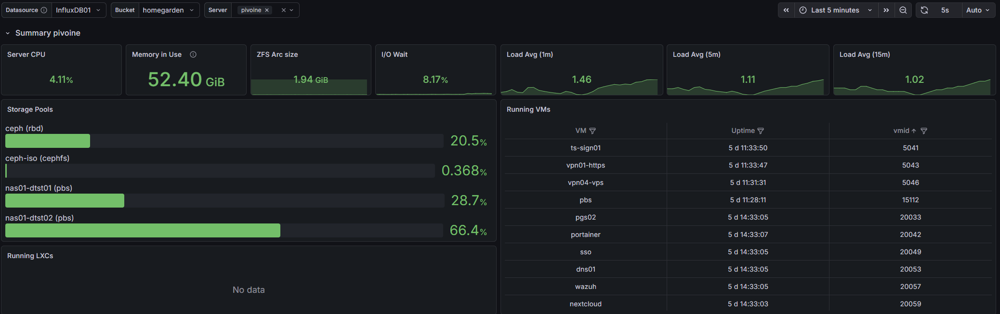
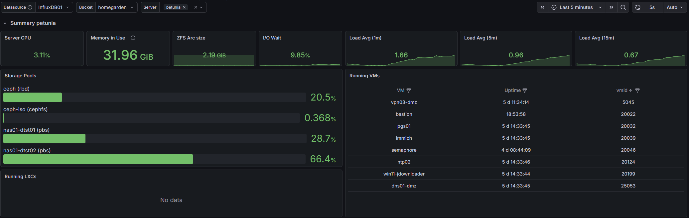
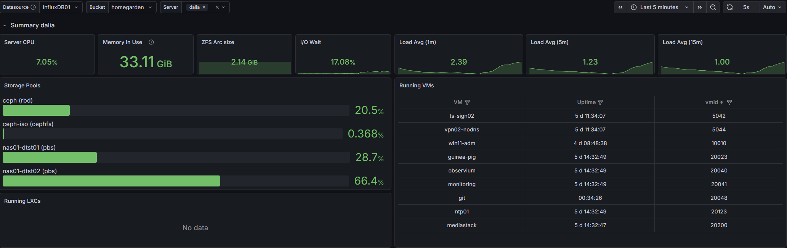

<h2>Welcome to the homegarden</h2>

So you want a tour, huh ?

I've been writing about bits and pieces of this lab for a while now. I crashed the <a href="https://blog.interlope.xyz/do-you-want-some-honey-because-bots-do">honey market</a>, I tried (and partially failed) to <a href="https://blog.interlope.xyz/how-to-evade-your-isp">evade my ISP</a>, I went <a href="https://blog.interlope.xyz/should-i-really-trust-my-binaries-rootkit-hunting-with-rkhunter">rootkit shopping</a> and I <a href="https://blog.interlope.xyz/fixing-an-error-i-made-a-few-years-ago-and-migrating-to-lvm">played with LVM</a>. But I've never actually sat you down and walked you through the whole thing. What's plugged in, what talks to what, and what's actually <em>running</em> in there.

So here we are. Grab a coffee, this one's gonna be long. Actually, grab the whole pot.

A quick disclaimer before we start, the same one I always give myself : this is a <strong>homelab</strong>. Or, as I like to call it, the <em>not-so-home-but-more-like-prod-lab</em>. None of this is "best practice" and none of this is a reference architecture. A good chunk of it exists purely because it was fun to build at 2 AM. That's the whole point. A production-ready homelab is about having fun trying things, and <em>then</em> doing them the right way because you got annoyed the third time it broke.

We'll do this in three parts, like a proper open house :

<ul>
<li><strong>The system tour</strong> : what's physically in the rack and what each node is made of</li>
<li><strong>The network tour</strong> : the fabric, the VLANs, and the zone-based firewall holding it all together</li>
<li><strong>The VM tour</strong> : the 40-ish machines actually doing the work</li>
</ul>

Let's open the door (which has been removed since a few years).
 

<h2><u>Part 1 - The system tour</u></h2>
<h3><u>What's in the box</u></h3>

Everything lives in a single 24U rack that, against all my hopes and dreams, is <strong>already full</strong>. I keep telling myself 24U is plenty. It is not. It is never plenty. If you have a rack, you understand. If you don't, congratulations, you still have money.

Here's the current occupancy :

<blockquote class="twitter-tweet">
Mon petit sapin de Noël à moi 👀 <a href="https://t.co/nL2pMo6nYg">pic.twitter.com/nL2pMo6nYg</a>
&mdash; interlope.xyz (@spleenftw) <a href="https://x.com/spleenftw/status/2004582089619050724?ref_src=twsrc%5Etfw">December 26, 2025</a></blockquote> 

Going piece by piece :

<ul>
<li><strong>UniFi Dream Machine SE (UDM-SE)</strong> : the network brain. It does everything, name it : routing, all the inter-VLAN firewalling, the IDS/IPS, and the geoblocking. Everything that crosses a zone boundary crosses <em>it</em>. We'll come back to this one in the network tour because it deserves its own section.</li>
<li><strong>USW-Aggregation</strong> : my 10G core. This is what makes the whole "distributed storage over real bandwidth" thing possible instead of being a sad slideshow. The Ceph traffic lives here, you may find some packets playing tag behind the curtains (tag, vlans, you got the joke right ?)</li>
<li><strong>TerraMaster U8-450</strong> : an 8-bay NAS. This is the bulk-storage and backup target. My Proxmox Backup Server dumps onto it (more on that in the VM tour), so even if a node decides to spontaneously combust, the backups are sitting somewhere else entirely and it also contains </li>
<li><strong>3x Proxmox nodes</strong> : <em>pivoine</em>, <em>petunia</em> and <em>dalia</em>. The actual compute. The flowers. The stars of the show.</li>
<li><strong>PowerWalker 1500 IoT UPS</strong> : 1500VA standing between my cluster and the kind of dirty power event that turns a healthy Ceph cluster into a very long evening.</li>
</ul>

And on the roadmap, because a homelab is never <em>done</em> even tho my wallet would like to :

<ul>
<li>a <strong>48-port PoE switch</strong>, because I've run out of ports the same way I've run out of U</li>
<li><strong>3x GL.iNet Comet PoE</strong> : KVM-over-IP, one per node, powered over PoE. Translation : I'll be able to see the BIOS of a dead node and power-cycle it <strong>from my phone</strong>, from anywhere. The day I break my proxmox cluster and I need to access the proxmox node physically, I'll be happy to have those.</li>
</ul>
<h3><u>The nodes - meet the flowers</u></h3>

All three nodes run <strong>Proxmox VE</strong> (because, and I cannot stress this enough, <strong>fuck broadcom</strong>). They're named after flowers, which is also why the cluster itself is called <strong>homegarden</strong>. Yes, I'm aware. No, I won't apologize.

The first one, <strong>pivoine</strong> (a.k.a. <em>pve01</em>), is the one that started it all : it was my single-node lab before this whole thing metastasized into a cluster even though I stopped at 3 nodes.

<ul>
<li><em>CPU</em> : AMD Ryzen 7 5700G (8c/16t)</li>
<li><em>RAM</em> : 4x32 DDR4 3200MHz</li>
<li><em>NIC</em> : Mellanox ConnectX-3 10GbE</li>
<li><em>OS disks</em> : 2x Samsung 870 EVO 500GB</li>
<li><em>VM disks</em> : 2x Samsung 980 PRO 2TB</li>
<li><em>Cooler</em> : Noctua NH-D12L </li>
<li><em>PSU</em> : be quiet! Pure Power 12 M 550W </li>
<li><em>Case</em> : Silverstone RM42-502</li>
</ul>

The two other nodes, <strong>petunia</strong> (<em>pve02</em>) and <strong>dalia</strong> (<em>pve03</em>), share the exact same build :

<ul>
<li><em>CPU</em> : AMD Ryzen 5 8600G (6c/12t)</li>
<li><em>RAM</em> : 2x24 DDR5 5600MHz</li>
<li><em>NIC</em> : Intel X710-DA2</li>
<li><em>OS disks</em> : 2x Intel S3700 200GB (old enterprise SSDs that refuse to die)</li>
<li><em>VM disks</em> : 2x Samsung 990 PRO 2TB</li>
<li><em>Cooler</em> : Noctua NH-L12S </li>
<li><em>Case</em> : RM23-502 Mini</li>
</ul>

And every node also got a <strong>dual 1G NIC</strong> bolted on, dedicated entirely to the cluster's nervous system. That's the network we're talking about next.

Add it all up and you've got a cluster with enough cores and RAM that I can be irresponsible with VM counts and still sleep fine. Which, spoiler, is exactly what I do.
But I wish I could crank it up to 4x24Gb on <strong>petunia</strong> and <strong>dalia</strong> because right now, if <strong>pivoine</strong> fails, they haven't enough RAM to sustain the load.
 

<h2><u>Part 2 - The network tour</u></h2>

This is the part I'm proudest of, so lads, buckle the f*** up.

<h3><u>The fabric : from a cursed ring to OpenFabric</u></h3>

Back when I first clustered these three, I built what I called a <strong>ring network</strong> : three direct cables forming a triangle between the nodes, no switch involved, dedicated to Corosync and cluster chatter. The idea is sound. Keep the latency-sensitive cluster traffic off the switch entirely and give Corosync a clean, private path.

The <em>implementation</em>, however, was held together with hope and static routes. I carved out three <code>/29</code> subnets, one per link, and manually wrote in <code>/etc/network/interfaces</code> : <code>post-up ip route add ... via ...</code> lines so that, say, pivoine could reach dalia by hairpinning through petunia. I also had to enable IP forwarding on every node to make the middle-man routing work.

It looked roughly like this :

<pre><code>            pivoine
           /        \
    (1G) /            \ (1G)
        /              \
   petunia ─────────── dalia
              (1G)</code></pre>

It worked, I mean, I wrote it and hoped it would work. 
Turns out it had two problems.

The first was cosmic. For reasons I will take to my grave, the <code>10.10.1.0/29</code> subnet simply <em>would not route</em>. I sat there until 3 AM rewriting configs, swapping cables, questioning my career, and then I changed it to <code>10.10.3.0/29</code>, it worked first try, and I never spoke of it again. Goodbye <code>10.10.1.x</code>, I loved you (I did not, I hate you, you costed me more sleep that you should have).

The second problem was real : static routing doesn't heal. Pull the petunia &lt;=&gt; dalia cable and the static path between those two is just... gone, until I fix it by hand. On a cluster where Corosync gets <em>very</em> opinionated about losing a link, that's not great.

So I upgraded the whole thing to <strong>OpenFabric</strong>.

OpenFabric (running on FRR, which Proxmox VE 9 now wires up natively through its SDN <em>Fabrics</em> feature) turns the triangle into a proper dynamic-routing fabric. Instead of brittle static routes between interface IPs, each node gets a <strong>loopback</strong> address in a <code>10.10.10.0/28</code> subet (<code>10.10.10.1/.2/.3</code>) and the fabric figures out the paths itself using a link-state protocol. Pull any single cable and it just <strong>reconverges</strong> over the remaining links. No more 3 AM. No more hand-editing. It heals.

<pre><code class="language-tabs">[pivoine]
root@pivoine:~# vtysh -c "show openfabric neighbor"
Area mesh:
 System Id           Interface   L  State         Holdtime SNPA
 petunia             enp7s0      2  Up            9        2020.2020.2020
 dalia               enp8s0      2  Up            10       2020.2020.2020
root@pivoine:~# vtysh -c "show openfabric route" | grep 10.10
 10.10.10.1/32  IP internal  0                            pivoine(4)
 10.10.10.2/32  IP TE        20      petunia   enp7s0     petunia(4)
 10.10.10.3/32  IP TE        20      dalia     enp8s0     dalia(4)
 10.10.10.1/32  0       -          -           -
 10.10.10.2/32  20      enp7s0     10.10.10.2  -
 10.10.10.3/32  20      enp8s0     10.10.10.3  -

[petunia]
root@petunia:~# vtysh -c "show openfabric neighbor"
Area mesh:
 System Id           Interface   L  State         Holdtime SNPA
 pivoine             enp8s0      2  Up            10       2020.2020.2020
 dalia               enp9s0      2  Up            10       2020.2020.2020
root@petunia:~# vtysh -c "show openfabric route" | grep 10.10
 10.10.10.2/32  IP internal  0                            petunia(4)
 10.10.10.1/32  IP TE        20      pivoine   enp8s0     pivoine(4)
 10.10.10.3/32  IP TE        20      dalia     enp9s0     dalia(4)
 10.10.10.1/32  20      enp8s0     10.10.10.1  -
 10.10.10.2/32  0       -          -           -
 10.10.10.3/32  20      enp9s0     10.10.10.3  -

[dalia]
root@dalia:~# vtysh -c "show openfabric neighbor"
Area mesh:
 System Id           Interface   L  State         Holdtime SNPA
 pivoine             enp8s0      2  Up            10       2020.2020.2020
 petunia             enp9s0      2  Up            10       2020.2020.2020
root@dalia:~# vtysh -c "show openfabric route" | grep 10.10
 10.10.10.3/32  IP internal  0                            dalia(4)
 10.10.10.1/32  IP TE        20      pivoine   enp8s0     pivoine(4)
 10.10.10.2/32  IP TE        20      petunia   enp9s0     petunia(4)
 10.10.10.1/32  20      enp8s0     10.10.10.1  -
 10.10.10.2/32  20      enp9s0     10.10.10.2  -
 10.10.10.3/32  0       -          -           -</code></pre>

And then I layered Corosync on top properly :

<ul>
<li><strong>link0</strong> rides the OpenFabric loopbacks : low latency, self-healing, the primary path</li>
<li><strong>link1</strong> rides the management network as an independent switched fallback</li>
</ul>
<pre><code class="language-tabs">[pivoine]
root@pivoine:~# corosync-cfgtool -n
Local node ID 1, transport knet
nodeid: 2 reachable
   LINK: 0 udp (10.10.10.1-&gt;10.10.10.2) enabled connected mtu: 1397
   LINK: 1 udp (10.100.2.101-&gt;10.100.2.102) enabled connected mtu: 1397

nodeid: 3 reachable
   LINK: 0 udp (10.10.10.1-&gt;10.10.10.3) enabled connected mtu: 1397
   LINK: 1 udp (10.100.2.101-&gt;10.100.2.103) enabled connected mtu: 1397

[petunia]
root@petunia:~# corosync-cfgtool -n
Local node ID 2, transport knet
nodeid: 1 reachable
   LINK: 0 udp (10.10.10.2-&gt;10.10.10.1) enabled connected mtu: 1397
   LINK: 1 udp (10.100.2.102-&gt;10.100.2.101) enabled connected mtu: 1397

nodeid: 3 reachable
   LINK: 0 udp (10.10.10.2-&gt;10.10.10.3) enabled connected mtu: 1397
   LINK: 1 udp (10.100.2.102-&gt;10.100.2.103) enabled connected mtu: 1397

[dalia]
root@dalia:~# corosync-cfgtool -n
Local node ID 3, transport knet
nodeid: 1 reachable
   LINK: 0 udp (10.10.10.3-&gt;10.10.10.1) enabled connected mtu: 1397
   LINK: 1 udp (10.100.2.103-&gt;10.100.2.101) enabled connected mtu: 1397

nodeid: 2 reachable
   LINK: 0 udp (10.10.10.3-&gt;10.10.10.2) enabled connected mtu: 1397
   LINK: 1 udp (10.100.2.103-&gt;10.100.2.102) enabled connected mtu: 1397</code></pre>

So now I can yank a single mesh cable and watch quorum not even flinch. Same physical triangle as before, completely different confidence level. I can now sleep deeply and dream about the <a href="https://eu.store.ui.com/eu/en/products/udm-beast">UDM BEAST</a> and its 25G interfaces...

<h3><u>The VLANs</u></h3>

Everything internal lives in RFC 1918 space (the good old 10.0.0.0/8), carved into one /24 per VLAN. I kinda like to think of myself as a rich guy using a whole /24 for 3 vms... The UDM-SE holds the gateway for each one. I'm not going to hand you the exact map (I've <a href="https://blog.interlope.xyz/how-to-evade-your-isp">written before</a> about not feeding people free metadata, so it'd be a bit rich to then publish my entire addressing plan), but the structure is the interesting part anyway :

Here's the full map :

<table>
<thead>
<tr>
<th>VLAN</th>
<th>What lives here</th>
<th>Zone</th>
</tr>
</thead>
<tbody>
<tr>
<td>1</td>
<td>UniFi gear management</td>
<td>admin</td>
</tr>
<tr>
<td>2</td>
<td>Proxmox / node management</td>
<td>admin</td>
</tr>
<tr>
<td>3</td>
<td>Ceph public</td>
<td>cluster</td>
</tr>
<tr>
<td>4</td>
<td>Ceph private</td>
<td>cluster</td>
</tr>
<tr>
<td>5</td>
<td>VPN</td>
<td>vpn</td>
</tr>
<tr>
<td>10</td>
<td>Admin</td>
<td>admin</td>
</tr>
<tr>
<td>15</td>
<td>Backup</td>
<td>backup</td>
</tr>
<tr>
<td>20</td>
<td>Production</td>
<td>internal</td>
</tr>
<tr>
<td>25</td>
<td>DMZ</td>
<td>dmz</td>
</tr>
<tr>
<td>30</td>
<td>IoT</td>
<td>internal</td>
</tr>
<tr>
<td>40</td>
<td>Lab / clients</td>
<td>internal</td>
</tr>
<tr>
<td>45</td>
<td>House</td>
<td>internal</td>
</tr>
</tbody>
</table>
<h3><u>Zone-based firewalling</u></h3>

This is where the UDM-SE does most of its work. Rather than writing a thousand VLAN-to-VLAN rules and slowly losing my mind, everything is grouped into <strong>firewall zones</strong>, and the rules live between zones :

<ul>
<li><strong>Admin</strong> : VLANs 1, 2 and 10</li>
<li><strong>Backup</strong> : VLANs 15</li>
<li><strong>Internal</strong> : VLANs 20, 30, 40 and 45</li>
<li><strong>DMZ</strong> : VLAN 25</li>
<li><strong>VPN</strong> : VLAN 5</li>
<li><strong>Cluster</strong> : VLANs 3 and 4</li>
</ul>

And the rules, in plain English :

The <strong>Admin</strong> zone is <em>not</em> a blanket "see everything" zone. VLANs 1 and 2 are <strong>pure management</strong> : UniFi gear talks on 1, servers management on 2, and that's it, no internet access and  they don't get to roam, at all. It's specifically <strong>VLAN 10</strong> that reaches everywhere. So "god mode" is one carefully-watched VLAN rather than a whole zone. If something on VLAN 10 gets popped, <em>that's</em> my bad day, but it's a much smaller attack surface than letting an entire admin block touch anything.

The <strong>Backup</strong> vlan used to live with the production stuff, until I realised that was exactly backwards. Your backups are the one thing that has to survive everything <em>else</em> getting owned, so the last place they should sit is the same broadcast domain as the services most likely to get popped. So it got its own zone, fully isolated and with <strong>no internet access at all</strong>. Nothing initiates a connection out, and nothing reaches in except the scoped flows that actually need to push or pull backups. If ransomware ever has a field day in the internal zone, it shouldn't even be able to <em>see</em> the box holding the copies that'll save me.

The <strong>Internal</strong> zone flows freely <em>between its own VLANs</em>, plus a few surgical exceptions : scoped management hops to specific vpn and cluster IPs (this is how Ansible reaches out to configure things), wazuh clients, nginx hosts in another zones, some prometheus scraping or uptime-kuma icmp and access <em>into</em> the DMZ where it's needed.

The <strong>DMZ</strong> is the paranoid one. It's walled off from everything, and it runs its <strong>own dedicated NTP and DNS</strong> so it never has to reach back into my production resolvers. The whole philosophy of a DMZ is "assume this gets compromised", so I don't want a compromised DMZ box doing DNS lookups against the same Pi-hole my house uses. It gets its own everything (I've got <a href="https://blog.interlope.xyz/how-to-evade-your-isp">opinions about who gets to see my DNS</a>, so no, the sketchy zone doesn't get to use the good resolver)).

The <strong>VPN</strong> and <strong>Cluster</strong> zones are also locked down tight, but they get one exception : they use the <strong>production DNS and NTP</strong>. They're trusted infrastructure rather than exposed services, so they get lucky and share the nice resolvers.

On top of all that, the UDM runs <strong>IDS/IPS</strong> and <strong>geoblocking</strong> at the edge. The geoblocking alone cuts an absurd amount of noise. If you've ever pointed a honeypot at the open internet (I have, <a href="https://blog.interlope.xyz/do-you-want-some-honey-because-bots-do">it's a whole post</a>), you know exactly how much of your inbound traffic is just a handful of countries' worth of bots knocking on every door. Block the regions you have no business talking to and the logs get a lot quieter.

<h2><u>Part 3 - The storage tour</u></h2>
<h3><u>The Hypervisors storage aka cephfs</u></h3>

Storage in this lab has had a <em>journey</em>, and the journey is half the fun.

It started as plain ZFS on a single node. Then, when I went to three nodes and got greedy for High Availability, I went down the <strong>LINSTOR + DRBD</strong> rabbit hole. I wrote a <a href="#">whole article</a> about building that out, complete with a keepalived VIP and an HA controller. 
And It worked ! It was also <em>a lot</em> : DRBD reactor, promoter configs, a replicated controller database, etc. It was a great thing to learn and a great thing to eventually retire. I spent wayyy too much time and nights to fix those freaking DRDB errors when an nvme failed and I had to reboot in SOS mode to rebuild the cluster until the sun came out and I had to go to work.

Because I've since moved to <strong>Ceph</strong>, integrated directly into the Proxmox cluster.

As for why you may ask ? The reason is just <em>fit</em>. Proxmox's Ceph integration is first-class : it's in the GUI, it's in the cluster's bones, and it gives me the shared, self-healing block storage I wanted without me hand-rolling the replication layer. Each node runs <strong>2 OSDs</strong>, so the cluster has 6 OSDs total spread across the three flowers, and the whole thing rides the 10G networking we set up earlier :

<ul>
<li><strong>Ceph public</strong> lives on VLAN 3, on a dedicated 10G NIC</li>
<li><strong>Ceph private / cluster</strong> lives on VLAN 4, also on a dedicated 10G NIC</li>
</ul>
<pre><code class="language-tabs">[tree]
root@pivoine:/home/interlope# ceph osd tree
ID  CLASS  WEIGHT    TYPE NAME         STATUS  REWEIGHT  PRI-AFF
-1         10.91574  root default
-3          3.63858      host dalia
 0   nvme   1.81929          osd.0         up   1.00000  1.00000
 1   nvme   1.81929          osd.1         up   1.00000  1.00000
-5          3.63858      host petunia
 2   nvme   1.81929          osd.2         up   1.00000  1.00000
 3   nvme   1.81929          osd.3         up   1.00000  1.00000
-7          3.63858      host pivoine
 4   nvme   1.81929          osd.4         up   1.00000  1.00000
 5   nvme   1.81929          osd.5         up   1.00000  1.00000

[df]
root@pivoine:/home/interlope# ceph osd df
ID  CLASS  WEIGHT   REWEIGHT  SIZE     RAW USE  DATA     OMAP      META     AVAIL    %USE   VAR   PGS  STATUS
 0   nvme  1.81929   1.00000  1.8 TiB  294 GiB  293 GiB   869 KiB  1.2 GiB  1.5 TiB  15.80  0.85   60      up
 1   nvme  1.81929   1.00000  1.8 TiB  401 GiB  399 GiB   1.2 MiB  1.5 GiB  1.4 TiB  21.51  1.15   69      up
 2   nvme  1.81929   1.00000  1.8 TiB  295 GiB  294 GiB   867 KiB  1.3 GiB  1.5 TiB  15.85  0.85   56      up
 3   nvme  1.81929   1.00000  1.8 TiB  402 GiB  401 GiB   1.1 MiB  1.5 GiB  1.4 TiB  21.59  1.16   73      up
 4   nvme  1.81929   1.00000  1.8 TiB  347 GiB  345 GiB  1018 KiB  1.6 GiB  1.5 TiB  18.60  1.00   66      up
 5   nvme  1.81929   1.00000  1.8 TiB  346 GiB  344 GiB  1014 KiB  1.5 GiB  1.5 TiB  18.56  1.00   63      up
                       TOTAL   11 TiB  2.0 TiB  2.0 TiB   6.0 MiB  8.6 GiB  8.9 TiB  18.65
MIN/MAX VAR: 0.85/1.16  STDDEV: 2.34

[stat]
root@pivoine:/home/interlope# ceph osd stat
6 osds: 6 up (since 6d), 6 in (since 6d); epoch: e4248</code></pre>

Each node is also a monitor, a manager and a metadata server for a fully capable HA storage service. 
I also keep a dedicated <strong>Ceph pool for ISOs</strong>, so my install media and templates sit on the same resilient, every-node-can-see-it storage as the VMs. No more "oh that ISO only exists on pivoine" nonsense, it's just <em>there</em>, cluster-wide.

<pre><code class="language-tabs">[status]
root@pivoine:/home/interlope# ceph -s
  cluster:
    id:     5819dbca-7480-4070-b1cb-aa44b2adfab1
    health: HEALTH_OK

  services:
    mon: 3 daemons, quorum pivoine,dalia,petunia (age 6d)
    mgr: petunia(active, since 6d), standbys: pivoine, dalia
    mds: 1/1 daemons up, 2 standby
    osd: 6 osds: 6 up (since 6d), 6 in (since 6d)

  data:
    volumes: 1/1 healthy
    pools:   4 pools, 129 pgs
    objects: 238.03k objects, 813 GiB
    usage:   2.0 TiB used, 8.9 TiB / 11 TiB avail
    pgs:     129 active+clean

  io:
    client:   773 KiB/s wr, 0 op/s rd, 84 op/s wr

[mon]
root@pivoine:/home/interlope# ceph mon stat
e3: 3 mons at {dalia=[v2:10.100.3.103:3300/0,v1:10.100.3.103:6789/0],petunia=[v2:10.100.3.102:3300/0,v1:10.100.3.102:6789/0],pivoine=[v2:10.100.3.101:3300/0,v1:10.100.3.101:6789/0]} removed_ranks: {} disallowed_leaders: {}, election epoch 402, leader 0 pivoine, quorum 0,1,2 pivoine,dalia,petunia

[mgr]
root@pivoine:/home/interlope# ceph mgr stat
{
    "epoch": 166,
    "available": true,
    "active_name": "petunia",
    "num_standby": 2
}

[fs]
root@pivoine:/home/interlope# ceph fs status
ceph-iso - 3 clients
========
RANK  STATE    MDS      ACTIVITY     DNS    INOS   DIRS   CAPS
 0    active  pve03  Reqs:    0 /s    22     23     16     12
       POOL          TYPE     USED  AVAIL
ceph-iso_metadata  metadata  1414k  2734G
  ceph-iso_data      data    30.2G  2734G
STANDBY MDS
   pve02
   pve01
MDS version: ceph version 19.2.3 (d74d168b1c80fb01e1a30d5e4ca9a45b12bc145b) squid (stable)</code></pre>

Is Ceph heavier than LINSTOR was ? Maybe it was, in some ways. Do I care ? No. The live migrations are clean, there's no IO delay that bothers me in practice, and it's one less bespoke stack for future-me to debug. And I sleep better at night. So I'd say it's a win-win for everyone.
 

<h3><u>The bulk &amp; backup storage aka the NAS</u></h3>

Now for the storage that isn't trying to be fast, smart and distributed : the <strong>TerraMaster U8-450</strong>, running <strong>TrueNAS</strong>. Where Ceph is the fast, shared, self-healing tier the VMs actually live on, the NAS is the slow, big, "just don't lose my stuff" tier.

TrueNAS gives me <strong>ZFS</strong> with a proper GUI on top, and I've fed it <strong>32GB of RAM</strong> for the ARC (because ZFS without RAM is just sadness with extra steps). It's split into <strong>two pools</strong> :

<ul>
<li><strong>pool-ssd</strong> : 4x 1TB SATA SSDs. The landing zone for quick backups, the stuff I want written fast and read back fast. Backups are going there every night with a 7 iteration retention policy </li>
<li><strong>pool-hdd</strong> : 4x 4TB Toshiba N300 spinning rust. The backups from the SSD pool <strong>replicate here weekly</strong> with a longer retention (30 iterations), plus it holds some films and the bulk data that doesn't need to be quick.</li>
</ul>

So the flow is : land fast on SSD, then let TrueNAS age it out onto the HDD pool weekly where I keep more history. My PBS datastores points here, so the whole VM fleet ends up safely off-cluster on storage that doesn't care if a node bursts into flames.

The one cloud on the horizon : <strong>free space is getting fierce</strong>. Between the bqckups and the films, those 4TB N300s are filling up faster than I'd like, and I've got my eye on some good old <strong>16TB disks</strong> to give the HDD pool some breathing room. It's never <em>if</em> you run out of space in a homelab, only <em>when</em>, and apparently my <em>when</em> is now.
 

<h3><u>Sending it offsite aka the 3-2-1 rule</u></h3>

Everything so far keeps my data safe <em>inside the rack</em>. Ceph survives a dead node, the NAS survives a dead Ceph, PBS survives a dead VM. But all of it sits in the same room, on the same UPS, behind the same door. So if the house floods or burns down, every single copy goes with it. Not great.

The rule everyone throws around is <strong>3-2-1</strong> : <strong>3</strong> copies of your data, on <strong>2</strong> different types of media, with <strong>1</strong> of them offsite. I had the 3 and the 2 sorted, but I was missing the offsite one. (actually they weren't really sorted out since it was the same NAS on different pools and disks...)

That's where <strong>PBS 4.0</strong> comes in, since it added <strong>S3-compatible object storage</strong> as a backup target. Instead of building a second physical PBS at a friend's place and maintaining it forever (and explaining to them why their internet dies every night at 2 AM), I can just push my backups to an S3 bucket in the cloud.

One gotcha : the S3 backend isn't just a dumb dump. PBS keeps a <strong>local cache</strong> (a dedicated dataset is best) so it's not hammering the S3 API and charging me for every read. So I get the cheap, infinite, somewhere-else storage without my restores crawling.

So the count finally adds up :

<ul>
<li><strong>Copy 1</strong> : the live data on Ceph</li>
<li><strong>Copy 2</strong> : the PBS backups on the NAS, different box, different media</li>
<li><strong>Copy 3</strong> : those same backups pushed offsite to S3</li>
</ul>

And since it's landing in someone else's datacenter, it's <strong>encrypted before it leaves the house</strong>. If you've read any of my other posts you already know I'm not handing a third party my plaintext anything. They get encrypted blobs, nothing else.

Is it perfect ? No. Cloud egress costs money and a full restore from S3 would be slow and annoying. But that copy is there for the day the whole rack is gone, not for restoring a VM I fat-fingered on a Tuesday. For everything else, the local NAS copy is right there and fast.

And then there's the dumbest copy of the lot : an external HDD on my desk that I plug in and sync by hand every now and then. No script, no schedule, I just remember to do it (most of the time I don't). The funny part is that a disk sitting unplugged on a shelf is the one thing ransomware physically can't reach, so my laziest backup somehow ended up being my most ransomware-proof one.
 

It looks like this :

<pre><code>   [ VMs ] ──► [ PBS ] ──► [ TrueNAS ]   (local, fast)
                       │
                       └──► [ S3 bucket ]   (offsite, encrypted)
                       └──► [ JBOD ]   (on my desk, encrypted)</code></pre>
<h2><u>Part 4 - The VM tour</u></h2>

Right, the part you actually clicked for.

At the time of writing I've got about <strong>40 VMs</strong> and <strong>1 golden debian13 template</strong> (the famous LVM-having Debian template, yes, the one I had to <a href="#">fix after years of regret</a>). I'll walk them zone by zone, because that's how I think about them.

<h3><u>VPN zone</u></h3>

This is my <strong>Tailscale</strong> corner, and it's a little more elaborate than "install Tailscale, done".

First, <strong>2 Tailscale signing nodes</strong>. The point of these is <em>independence</em> : by running my own signing nodes, node signing happens on infrastructure I own instead of relying fully on Tailscale's control plane for that trust decision. I use the service, but I hold some of my own keys.

Then <strong>4 Tailscale instances</strong>, each with a deliberately different job :

<ol>
<li><strong>Full tunnel</strong> : routes <em>all</em> traffic, hands out DNS. The "I want everything to go home" exit node.</li>
<li><strong>Restricted</strong> : routes a limited set of subnets, <strong>no DNS</strong>. For when I want access to <em>some</em> of the lab without my whole device's traffic and name resolution going through it.</li>
<li><strong>Family</strong> : for the household, and its egress is deliberately pushed <strong>through the DMZ</strong>. The family gets connectivity without getting a door into the trusted internals but still got an ad-less network with better security.</li>
<li><strong>VPS entry</strong> : this is how my external VPS reaches <em>into</em> the homelab and exposes services to the internet. The bridge from the outside world to the inside, on my terms only.</li>
</ol>

Four instances sounds like overkill, but each one is a different trust posture, and keeping them as separate nodes means I never have to stop and ask "wait, which policy is this connection under".

<h3><u>Admin zone</u></h3>
<ul>
<li><strong>Win11 VM</strong> : the management workstation. Sometimes you just need a Windows box with the right tools and a real browser to administer something that hates being administered from a terminal.</li>
<li><strong>SSH bastion</strong> : the management workstation but shipped with Linux. It's like the CLI bastion where the win11 box is the click bastion.</li>
</ul>
<h3><u>Backup zone</u></h3>
<ul>
<li><strong>Proxmox Backup Server (virtualized)</strong>, with its datastore pointed at the <strong>Truenas TerraMaster box</strong>. This is the "3 AM peace of mind" machine. ZFS, Deduplicated, incremental backups of the whole VM fleet, living on storage that is <em>not</em> the Ceph cluster, so a catastrophic cluster event doesn't take the backups with it. The backup VLAN is its own segment for exactly this reason : backups should be reachable for backing up and basically nothing else.</li>
</ul>
<h3><u>Production zone</u></h3>

This is where most of the actual <em>stuff</em> lives. It's a lot, so let me group it.

<strong>The data backbone</strong>

<ul>
<li><strong>pgs01 / pgs02</strong> : a PostgreSQL <strong>master/replica</strong> pair. A surprising number of the services below point at this pair instead of running their own throwaway database. One good, replicated Postgres beats a dozen scattered SQLite files hidden inside containers.</li>
</ul>
<pre><code class="language-tabs">[pgs01]
root@pgs01:~# sudo -u postgres psql -p 5432 -c "SELECT slot_name, slot_type, active FROM pg_replication_slots;"
 slot_name | slot_type | active
-----------+-----------+--------
 replica_1 | physical  | t
(1 row)

root@pgs01:~# sudo -u postgres psql -p 5432 -c "SELECT usename, client_addr, state, sent_lsn, replay_lsn FROM pg_stat_replication;"
  usename  | client_addr  |  state  |  sent_lsn  | replay_lsn
-----------+--------------+---------+------------+------------
 replicata | pgs02 | catchup | 0/F3060000 | 0/F3AD34F8
(1 row)

[pgs02]
root@pgs02:~# sudo -u postgres psql -p 5432 -c "SELECT pg_is_in_recovery();"
 pg_is_in_recovery
-------------------
 t
(1 row)

root@pgs02:~# sudo -u postgres psql -p 5432 -c "SELECT status, sender_host, slot_name, written_lsn, flushed_lsn, latest_end_lsn, last_msg_receipt_time FROM pg_stat_wal_receiver;"
  status   | sender_host  | slot_name | written_lsn | flushed_lsn | latest_end_lsn |     last_msg_receipt_time
-----------+--------------+-----------+-------------+-------------+----------------+-------------------------------
 streaming | pgs01 | replica_1 |             | 0/F3AD34F8  | 0/F6EC9EF8     | 2026-05-30 03:49:11.642677+02
(1 row)</code></pre>

<strong>Identity &amp; access</strong>

<ul>
<li><strong>SSO VM</strong> : running <strong>Pocket-ID</strong> for <strong>passkey-based SSO</strong> across the entire homelab. One identity, passkeys, everything behind it, less password and attack surface.</li>
<li><strong>Guacamole VM</strong> : clientless web RDP, used to reach the Windows machines sitting over in the DMZ without exposing RDP directly and easier Windows management.</li>
</ul>

<strong>Reverse proxy &amp; docs</strong>

<ul>
<li><strong>Nginx VM</strong> : running <strong>Nginx Proxy Manager (NPM)</strong>, pointed at the pgs pair. Combined to my dns, this is what turns my pile of <code>host:port</code> services into clean <code>something.hlb1.lan</code> URLs with Let's Encrypt certs.</li>
<li><strong>Gitea VM</strong> : installed from binaries, also backed by pgs. It mostly hosts my <strong>Ansible playbooks</strong> and every <code>docker-compose.yml</code> in the lab, each on its own branch. My infrastructure's source of truth.</li>
<li><strong>Wiki.js</strong> : also backed by pgs, running on docker, internal documentation, because future-me has the memory of a goldfish and deserves to be written to.</li>
</ul>

<strong>Automation</strong>

<ul>
<li>

<strong>Semaphore VM</strong> : installed from binaries, pgs-backed. The web UI and scheduler in front of all those Ansible playbooks from Gitea. This is how config actually gets pushed out across the fleet (and why the firewall has those scoped management exceptions into other zones). I have a few dedicated categories for my homelab such as :

<ul>
<li><em>apt</em> : this is what allows my entire homelab to stay up to date and modify some apt sources directory. It also runs an <code>apt update</code>  playbook every day at 7am.</li>
<li><em>security</em> : this is where I write my CVE patch for like dirtyfrag or copyfail.</li>
<li><em>utilities, ntp, snmpd</em> : this is where the lazy IT guy shows up with its playbooks like deploy the snmpd con ; update a file ; check the linux version or the disk usage</li>
<li><em>ssh</em> : this is where the ssh guidelines are applied with upmost respect and dedication.</li>
</ul>
</li>
</ul>
<pre><code class="language-tabs">[apt]
ansible@bastion:~/semaphore/apt$ ls
apt_add_package.yml  apt_full_upgrade.yml    apt_update.yml   conf               set_no_apt_cache.yml
apt_del_package.yml  apt_update_sources.yml  apt_upgrade.yml  set_apt_cache.yml
[security]
ansible@bastion:~/semaphore/security$ ls
cis_harden.yml  cis_vars.yml  copyfail-and-dirtyfrag.yml  requirements.yml
[utilities]
ansible@bastion:~/semaphore/utilities$ ls
deploy_k8s.yml    disk_space.yml  linstor_pve_cluster.yml  nuke_cluster.yml  rsyslog.yml     update_initramfs.yml
disable_ipv6.yml  enable_brr.yml  linux_version.yml        resolv.conf       update_dns.yml  update_portainer_agent.yml
[ntp]
ansible@bastion:~/semaphore/ntp$ ls
check_ntpsec_status.yml  ntp.conf  ntp-migration.yml  ntpsec_update_conf.yml
[snmpd]
ansible@bastion:~/semaphore/snpmd$ ls
observium_deploy.yml  snmpd.conf
[ssh]
ansible@bastion:~/semaphore/ssh$ ls
check_authorized_keys.yml  conf  remove_ssh_key.yml  ssh.yml</code></pre>

<strong>Monitoring &amp; security - the graphs we all secretly love</strong>

<ul>
<li><strong>Monitoring VM</strong> : <strong>Grafana</strong> (pointed at pgs01/02), <strong>Prometheus</strong>, and <strong>InfluxDB</strong>. The dashboards. The Graphics diseases hit me strong.</li>
</ul>
<pre><code class="language-carousel">

</code></pre>
<ul>
<li><strong>Observium</strong> : network-side monitoring, keeping an eye on the gear.</li>
<li><strong>Wazuh</strong> : a full <strong>Wazuh</strong> deployment with <strong>agents across the entire homelab</strong>. Log collection, file-integrity monitoring, intrusion detection on the endpoints themselves. After <a href="https://blog.interlope.xyz/should-i-really-trust-my-binaries-rootkit-hunting-with-rkhunter">going down the rabbit hole</a> on why you can never truly trust a compromised machine, having centralized eyes on every box is less paranoia and more <em>therapy</em>. Even though I never actually look at all those logs...</li>
<li><strong>uptime-kuma</strong> : the simple, beautiful "is it up ? is it green ?" board.</li>
<li><strong>gotify</strong> : push notifications, so the lab can yell at me. I kinda like when it yells at me, gotta admit.</li>
</ul>

<strong>The "useful to actual humans" services</strong>

<ul>
<li><strong>Immich</strong> : via docker, self-hosted photos. Google Photos, but mine.</li>
<li><strong>Nextcloud AIO</strong> : also via docker, mostly files, the personal-cloud staple.</li>
<li><strong>media stack VM</strong> : docker again guys ? Docker-based, <strong>Jellyfin</strong> and friends. Movie night, self-hosted.</li>
<li><strong>Portainer VM</strong> : a Docker host managed through Portainer that also runs a grab-bag of smaller tools : <strong>BentoPDF</strong>, a <strong>dev instance of this very blog</strong>, <strong>Homebox</strong>, <strong>PairDrop</strong> (AirDrop for everyone), and <strong>Vaultwarden</strong> for secrets and passwords.</li>
</ul>

<strong>Lab-of-the-lab</strong>

<ul>
<li><strong>GNS3 (gns03)</strong> : a network emulation sandbox for testing topologies and grinding through certifications without touching the real gear.</li>
</ul>

<strong>Time</strong>

<ul>
<li><strong>ntp01 / ntp02</strong> : the production time source the trusted zones lean on. Two of them, because time is the one thing you really don't want a single point of failure on (ask anyone who's debugged a cluster with drifting clocks).</li>
</ul>
<h3><u>DMZ zone</u></h3>

The sealed-off zone, with its own self-sufficient basics :

<ul>
<li><strong>Pi-hole DNS</strong> : dedicated DMZ resolver, completely separate from the production one.</li>
<li><strong>NTP/DNS box</strong> : the DMZ's own time and name services, so it never reaches back into prod.</li>
<li><strong>A few Windows VMs</strong> : idle-game boxes and similar low-trust throwaways. The kind of thing you specifically <em>don't</em> want on your trusted network, which is what a DMZ is for. (These are the ones Guacamole reaches over to.)</li>
</ul>
<h3><u>IOT zone</u></h3>
<ul>
<li><strong>Home Assistant OS (HAOS)</strong> : the whole smart-home brain, deliberately corralled on the IoT VLAN. IoT devices are not exactly famous for their security, so they get their own segment and HAOS sits in there with them rather than letting them anywhere near the good stuff.</li>
</ul>
<h3><u>LAB zone </u></h3>
<ul>
<li><strong>A Kubernetes cluster</strong> : 1 control-plane node + 3 workers. My IaC and deployment playground. Somewhere to throw manifests, break things, test GitOps flows, and generally make a mess that doesn't touch anything load-bearing and did I already said break things ? Every homelab needs a corner where breaking things is the <em>point</em>.
 </li>
</ul>
<h2><u>Putting it all together</u></h2>

So here's the whole organism, zoomed all the way out :

Three flowers, one garden, a 10G spine for storage, a self-healing 1G fabric for the cluster's heartbeat, a zone-based firewall keeping everything in its lane, and a small city of VMs doing everything from serving my photos to catching bots to running my house.
 

<h2><u>Conclusion</u></h2>

If you've made it this far : thanks, and also, get a hobby (he says, having just written a small novel about his own).

None of this happened in a weekend. It's the result of a lot of late nights, a few cursed subnets, one entire storage stack I built and then retired, and a rack that's been full since roughly the day I bought it. Bits of it are over-engineered. Bits of it are held together with <code>post-up</code> and prayer. The bastion is on the wrong VLAN. And every one of those rough edges is something I learned by breaking first.

That, to me, is what a production-ready homelab really is. Not a perfect, finished, reference-grade datacenter, but a living thing you keep poking at because poking at it is fun. The day it's "done" is the day it gets boring, and then I'll just buy another switch I don't have room for and start again.

Thanks for reading me,

spleenftw
