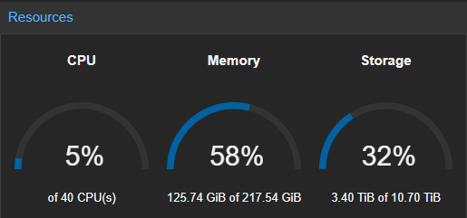

<h2>Cooking lessons 101: Proxmox, LINSTOR, and 10G cards</h2>

Homelab-ing should be fun, right? Right.

Until you decided to go down the path of what I call : the <u><em>not</em>-<em>so</em>-<em>home</em>-<em>but</em>-<em>more</em>-<em>like</em>-<em>prod</em>-<em>lab</em>-ing</u>

Well, I recently had the joy (read: chaos) of upgrading from a single Proxmox node to a beautiful, powerful and shiny 3-node cluster. Sounds great on paper until it's 3 AM and i'm wondering why the third node won't do the exact same thing as the first two.

So today, let’s unpack the mess together. We’ll go over:

<ul>
<li>What kind of hardware these Proxmox nodes are running on</li>
<li>Why and how I went down the SDS/distributed-storage <strong>rabbit hole</strong></li>
<li>How I actually set up the cluster </li>
<li>Benchmarks (because we like numbers <em>go brrrrr</em>... )</li>
</ul>
<h2><u>Current node, <em>peony</em> :</u></h2>

Before migrating, i had a single proxmox node that we'll call <em>pve01</em> or <em>peony</em>, both works.

This beauty has been running on :

<ul>
<li><em>OS</em> : Proxmox (because <strong>fuck broadcom</strong>)</li>
<li><em>CPU</em> : AMD Ryzen 7 5700G (8c, 16t | 3.8 GHz / 4.6 GHz)</li>
<li><em>COOLER</em> : Noctua NH-D12L</li>
<li><em>MOBO</em> :TUF GAMING X570-PLUS</li>
<li><em>RAM</em> : 4x32 DDR4 3200MHz CL16 Corsair Vengeance</li>
<li><em>NIC</em> : MELLANOX X-3-10GbE</li>
<li><em>OS SSD</em> : 2x Samsung SSD 870 EVO 500GB</li>
<li><em>VM SSD</em> : 2x Samsung SSD 980 PRO 2TB</li>
<li><em>PSU</em> : Pure Power 12 M 550 W</li>
<li><em>CASE</em> : Silverstone SST-RM42-502</li>
</ul>

I chose this build for a few reasons : I needed 2 nvme Gen4 ports to be able to run a zfs-pool with the 980 pro at full speed. And I also wanted to have an iGPU because I had no needs for an entire GPU and it's power consumption. 
I also chose an old Mellanox X-3 for an LACP bond to fully use my USW-Aggregation.

<h2><u>The two newborn nodes, <em>petunia</em> and <em>dahlia</em> :</u></h2>

Those two nodes, <em>pve02</em> and <em>pve03</em> aka <em>petunia</em> and <em>dahlia</em> have the same hardware :

<ul>
<li><em>OS</em> : Proxmox (because once again, <strong>fuck broadcom</strong>)</li>
<li><em>CPU</em> : AMD Ryzen 5 8600G (6c, 12t | 4.3 GHz / 5.0 GHz)</li>
<li><em>COOLER</em> : Noctua NH-L12S</li>
<li><em>MOBO</em> : ASUS TUF GAMING A620M-PLUS</li>
<li><em>RAM</em> : 2x24 DDR5 5600MHz CL46 CRUCIAL PRO</li>
<li><em>NIC</em> : INTEL X710-DA2</li>
<li><em>OS SSD</em> : 2x Dell Intel S3700 200GB</li>
<li><em>VM SSD</em> : 2x Samsung SSD 990 PRO 2TB</li>
<li><em>PSU</em> : Pure Power 12 M 550 W</li>
<li><em>CASE</em> : RM23-502 Mini</li>
</ul>

And I added to all three nodes a dual 1G NIC for a <em>ring-network</em> dedicated to the proxmox cluster &amp; the corosync service.

As for what a <em>ring-network</em> is, it's a basic network topology where each nodes is connected to two other nodes, without using a switch.

So it should look like this :

pve01 : 

<pre><code>pve01.nic1 &lt;=&gt; pve02.nic1
pve01.nic2 &lt;=&gt; pve03.nic1</code></pre>

pve02 :

<pre><code>pve02.nic1 &lt;=&gt; pve01.nic1
pve02.nic2 &lt;=&gt; pve03.nic2</code></pre>

pve03 :

<pre><code>pve03.nic1 &lt;=&gt; pve01.nic1
pve03.nic2 &lt;=&gt; pve02.nic2</code></pre>
<h2><u>The SDS rabbit-hole :</u></h2>

As this homelab is changing, updating and upgrading into more like a production-ready setup, I decided to go down the HA (<em>High Availability</em>) path since I had 3 nodes now. 

For simple HA in a Hypervisor-OS cluster (let it be Proxmox, HyperV, ESXI, OpenNebula, etc) you'll need one thing : 

<ul>
<li>at least 3 nodes for a quorum (minimum number of cluster members that have to agree the cluster is or not healthy. So there's a vote, and 3 is a minimum to achieve majority)</li>
</ul>

For a more <u>efficient</u> HA in a Hypervisor-OS cluster (let it be Proxmox, HyperV, ESXI, OpenNebula, etc) you'll need two things : 

<ul>
<li>at least 3 nodes for a quorum (minimum number of cluster members that have to agree the cluster is or not healthy. So there's a vote, and 3 is a minimum to achieve majority)</li>
<li>distributed storage : each volume that will be created (volume = VM/CT disk) will be at least replicated on another node. So that migrating from <em>pve02</em> to <em>pve03</em> will only migrate the RAM &amp; .cfg file since the disk is already present.</li>
</ul>

In PVE (Proxmox Virtual Environnement), there's a few ways to achieve this (there may be more, I only know and used those):

<ul>
<li>ZFS replication</li>
<li>CephFS </li>
<li>iSCSI </li>
<li>Linstor</li>
</ul>
<h3><u>ZFS Replication :</u></h3>

If you are planning to use ZFS for your storage pool, <em>ZFS replication</em> may be a solution. It'll replicate the snapshot of the disk every x period of time (could be every minute, every 15 minutes; whatsoever). So if HA (or yourself) decided to migrate the disk, you'll only lose the data that hasn't been synced by the ZFS replication. This works like a charm, without a lot of configuration, but it wasn't what I wanted. I wanted something more... <strong>sophisticated</strong>, I'm an homelabber after all, <em>I have no need but greed.</em>

<pre><code>     [pve01]                          [pve02]
   ┌──────────┐                   ┌─────────────┐
   │  VM Disk │── Snapshot ---&gt;   │  VM Disk    │
   │  Pool A  │                   │  Pool B     │
   └──────────┘                   └─────────────┘
         ↑                               ↑
       Writes                           Replicated every X min</code></pre>
<h3><u> CephFS : </u></h3>

CephFS is actually full integrated within the PVE ecosystem and could have been a solution. It uses OSD and CephMON (Monitor) that are lightweight nodes that keep track of the cluster's health, metadata and where the OSD are so that it can recover automatically if a node fails.
The hardware requirements are quite heavy : 

<ul>
<li>10G NICs minimum where even 40Gbps links can be saturated by NVMEs (Gen4 nvme goes up to 7GBps, roughly 40 to 60Gbps).</li>
<li>2 NIC, since they will be used as what they call a :<ul>
<li>"Private / Cluster Network" : used for the public storage communication (like VMs, Proxmox, LXC)</li>
<li>"Public Network" : used for the OSD (Object Storage Daemon) replication and heartbeat traffic.</li>
</ul>
</li>
<li>More and fast disks to be used as WAL (<strong>W</strong>rite <strong>A</strong>head <strong>L</strong>ogs), typically NVME as WAL and stores it on SATA SSD / HDD.</li>
</ul>

This could have been a way for me, easy to setup. But the hardware requirements were too heavy for me and since I already had a 10G switch, I feared it would be very slow and be a nightmare to optimize it.

<pre><code>            +----------------+
            |     MONITOR    |
            |    (Ceph MON)  |
            +----------------+
                    ▲
      ┌─────────────┼─────────────┐
      ▼             ▼             ▼
 +---------+   +---------+   +---------+
 |  OSD 1  |   |  OSD 2  |   |  OSD 3  |
 | NVMe+HDD|   | NVMe+HDD|   | NVMe+HDD|
 +---------+   +---------+   +---------+
      ▲             ▲             ▲
      │             │             │
      └─────────────┴─────────────┘
                    │
            Clients (PVE Nodes)
</code></pre>
<h3><u> iSCSI (<strong>I</strong>nternet <strong>S</strong>mall <strong>C</strong>omputer <strong>S</strong>ystem <strong>I</strong>interface) : </u></h3>

In easy term, let's say I have a NAS with disks. I create an iSCSI share, which will be mounted to each PVE nodes of the cluster. I can now create VM/LXC on this storage, and since it'll be shared across the cluster, I could migrate it easily.

For the PVE nodes, it would look like they each have the <strong>same</strong> big disk mounted.

<pre><code>       +--------------------+
       |       NAS          |
       |   iSCSI Target     |
       +--------------------+
         │       │       │
         │       │       │
   +-----+       |       +-----+
   |             |             |
[pve01]       [pve02]       [pve03]
   │             │             │
   └─────────────┴─────────────┘
            Shared Disk
(appears as the same big local disk)</code></pre>
<h3><u> The chosen one : Linstor : </u></h3>

Linstor is kinda a mix of CephFS and iSCSI. It's an open-source storage management solution for block storage (like iSCSI do). 
It works off 3 <em>Core</em> Components :

<ul>
<li>the Linstor Controller <ul>
<li>brain of the shared storage</li>
<li>keeps track of all the storage ressources, nodes and replica</li>
</ul>
</li>
<li>the Linstor Satellite<ul>
<li>each node is considered as a Satellite</li>
<li>manage the local disks and execute the replication commands</li>
</ul>
</li>
<li>and obviously, the Storage Pools<ul>
<li>can be ZFS, LVM &amp; LVM-thin</li>
<li>managed by Linstor</li>
<li>used to store the VMs data</li>
</ul>
</li>
</ul>
<pre><code>          +------------------+
          |LINSTOR Controller|
          +------------------+
                    │
   ┌────────────────┴─────────────────┐
   ▼                                  ▼
+-------+                         +-------+
| Satel |                         | Satel |
| Disk1 |                         | Node2 |
| Disk1 |       &lt;-- Rep --&gt;       | Disk1 |
+-------+                         +-------+
   │                                  │
[pve01]                            [pve02]
   │                                  │
   └── Volumes shared across nodes. ──┘</code></pre>

Wait, this could work, this could be it. This could be challenging and fun. So I decided to spin up a few VMs, install PVE on it and tried thing. After a few days of <em>trial and error</em>, I finally obtained a virtual cluster with a distributed storage across it, working like a charm !

<h2><u>How I actually set up the cluster : </u></h2>

As I said before, I used a ring network and Distributed Storage for a better HA.

<h3><u> The ring network : </u></h3>

First thing first, how to setup the ring-network :

Connect each nodes to each other. You'll need 3 networks (pve01 to pve02, pve01 to pve03 and pve02 to pve03), I went with three /29, which gives me plenty of room with 6 IP Adresses.

<ul>
<li>network pve01 to pve02 : 10.10.0.1/29 and 10.10.0.2/29</li>
<li>network pve01 to pve03 : 10.10.3.1/29 and 10.10.3.2/29</li>
<li>network pve02 to pve03 : 10.10.2.1/29 and 10.10.2.2/29</li>
</ul>

You may be wondering, where the hell is the 10.10.1.1/29 and why did he chose the 10.10.3.1/29 network. Great answer.

<strong>Somehow, against all logic, it just wouldn't work.</strong> 

Trust me. I was there, staring at my computer screen until 3 AM, wondering why the hell 10.10.1.1/29 &amp; 10.10.1.2/29 were not working. Until I simply tried the 10.10.3.1/29 and it worked top notch, so I went with it. Goodbye my <code>10.10.1.1/29 and 10.10.1.2/29</code>, I truly loved you (f*ck you I hate you).

You'll also need to enable routing on each of your proxmox nodes so that pve01 can talk with pve03 via the pve02 link. Quite a headache isn't it ?

On pve01 :

<pre><code>interlope@pivoine:~$ ip -br -c a | grep 10.10
enp7s0           UP             10.10.0.1/29 fe80::1efd:8ff:fe7a:e2b8/64
enp8s0           UP             10.10.3.1/29 fe80::1efd:8ff:fe7a:e08c/64</code></pre>
<pre><code>interlope@pivoine:~$ cat /etc/network/interfaces | grep route
        post-up ip route add 10.10.2.0/29 via 10.10.0.2 dev enp7s0</code></pre>
<pre><code>root@pivoine:/home/interlope# traceroute 10.10.2.2
traceroute to 10.10.2.2 (10.10.2.2), 30 hops max, 60 byte packets
 1  10.10.0.2 (10.10.0.2)  0.095 ms  0.076 ms  0.057 ms
 2  10.10.2.2 (10.10.2.2)  0.120 ms  0.105 ms  0.119 ms</code></pre>

It can join the pve03 while passing by the pve02 node.

On pve02 :

<pre><code>interlope@petunia:~$ ip -br -c a | grep 10.10
enp8s0           UP             10.10.0.2/29 fe80::1efd:8ff:fe7a:e239/64
enp9s0           UP             10.10.2.1/29 fe80::1efd:8ff:fe7a:e23a/64</code></pre>
<pre><code>interlope@petunia:~$ cat /etc/network/interfaces | grep route
        post-up ip route add 10.10.3.0/29 via 10.10.2.2 dev enp9s0</code></pre>
<pre><code>root@petunia:/home/interlope# traceroute 10.10.3.1
traceroute to 10.10.3.1 (10.10.3.1), 30 hops max, 60 byte packets
 1  10.10.2.2 (10.10.2.2)  0.091 ms  0.063 ms  0.088 ms
 2  10.10.3.1 (10.10.3.1)  0.140 ms  0.130 ms  0.121 ms</code></pre>

It can join the pve01 while passing by the pve03 node.

On pve03 :

<pre><code>interlope@dalia:~$ ip -br -c a | grep 10.10
enp8s0           UP             10.10.3.2/29 fe80::1efd:8ff:fe7a:e497/64
enp9s0           UP             10.10.2.2/29 fe80::2e0:4cff:fe68:f52/64</code></pre>
<pre><code>interlope@dalia:~$ cat /etc/network/interfaces | grep route
        post-up ip route add 10.10.0.0/29 via 10.10.3.1 dev enp8s0</code></pre>
<pre><code>root@dalia:/home/interlope# traceroute 10.10.0.2
traceroute to 10.10.0.2 (10.10.0.2), 30 hops max, 60 byte packets
 1  10.10.3.1 (10.10.3.1)  0.106 ms * *
 2  10.10.0.2 (10.10.0.2)  0.135 ms  0.119 ms  0.152 ms</code></pre>

It can join the pve02 while passing by the pve01 node.

Now I can simply create my cluster <em>homegarden</em> on pve01, add the two NIC links and join it with pve02 and pve03, wonderful.

As for the SDS, that's a whole other ball game.

<h3><u> Linstor : </u></h3>

This tutorial will be written this way : each step will tell you on which node to execute the commands :

<ul>
<li>Installing linstor, on <strong>all nodes</strong> :</li>
</ul>
<pre><code>wget -O /tmp/linbit-keyring.deb https://packages.linbit.com/public/linbit-keyring.deb
dpkg -i /tmp/linbit-keyring.deb
PVERS=9 &amp;&amp; echo "deb [signed-by=/etc/apt/trusted.gpg.d/linbit-keyring.gpg] http://packages.linbit.com/public/ proxmox-$PVERS drbd-9" &gt; /etc/apt/sources.list.d/linbit.list

apt update
apt -y install drbd-dkms drbd-utils drbd-reactor proxmox-default-headers linstor-proxmox linstor-controller linstor-satellite linstor-client linstor-proxmox linstor-gui vim</code></pre>
<ul>
<li>Loading the <code>drdb</code> kernel module into memory first, and simply enable it at boot, on <strong>all nodes</strong> :</li>
</ul>
<pre><code>modprobe drbd
echo "drbd" &gt;&gt; /etc/modules
reboot</code></pre>
<ul>
<li>Enable the linstor-controller, on <strong>node 1</strong> :</li>
</ul>
<pre><code>systemctl enable --now linstor-controller</code></pre>
<ul>
<li>Configure the linstor-client, on <strong>all nodes</strong> :</li>
</ul>
<pre><code>cat &lt;&lt;EOF &gt; /etc/linstor/linstor-client.conf
[global]
controllers=ipnode1,ipnode2,ipnode3
EOF</code></pre>
<ul>
<li>Edit the linstor-satellite, on <strong>all nodes</strong> :</li>
</ul>
<pre><code>systemctl edit linstor-satellite.service 
[Service]
Type=notify
TimeoutStartSec=infinity
Environment=LS_KEEP_RES=linstor_db</code></pre>
<ul>
<li>Create the linstor cluster, on <strong>node 1</strong> :</li>
</ul>
<pre><code>linstor node create hostnamenode01 ipnode1
linstor node create hostnamenode02 ipnode2 
linstor node create hostnamenode03 ipnode3
linstor node set-property hostnamenode01 DrbdOptions/AutoEvictAllowEviction false
linstor node set-property hostnamenode02 DrbdOptions/AutoEvictAllowEviction false
linstor node set-property hostnamenode03 DrbdOptions/AutoEvictAllowEviction false</code></pre>

Note : the <code>DrbdOptions/AutoEvictAllowEviction false</code> is to avoid your nodes to be auto-removed from the linstor cluster during temporary issues and to also avoid split-brain scenarios (data still being written on a node that has lost communication with the cluster), creating data corruption and divergent data.

Which should looks like this :

<pre><code>interlope@pivoine:~$ linstor node list
╭──────────────────────────────────────────────────────────╮
┊ Node    ┊ NodeType  ┊ Addresses                 ┊ State  ┊
╞══════════════════════════════════════════════════════════╡
┊ dalia   ┊ SATELLITE ┊ 10.100.4.103:3366 (PLAIN) ┊ Online ┊
┊ petunia ┊ SATELLITE ┊ 10.100.4.102:3366 (PLAIN) ┊ Online ┊
┊ pivoine ┊ SATELLITE ┊ 10.100.4.101:3366 (PLAIN) ┊ Online ┊
╰──────────────────────────────────────────────────────────╯</code></pre>

I decided to go down the path of a ZFS pool on each node with raid1 (mirroring) between the two nvmes, do what suits yourself and your cluster :

<pre><code>zpool create pool-nvme-01 mirror /dev/nvme0n1 /dev/nvme1n1</code></pre>
<ul>
<li>Create the storage-pool for the zfs-share, on <strong>node 1</strong> :</li>
</ul>
<pre><code>linstor storage-pool create zfsthin pve01 sto-pool_zfs-01 pool-nvme-01
linstor storage-pool create zfsthin pve02 sto-pool_zfs-01 pool-nvme-01
linstor storage-pool create zfsthin pve03 sto-pool_zfs-01 pool-nvme-01</code></pre>
<ul>
<li>Create the resource-group to use the storage-pool we juste created, on <strong>node 1</strong> :</li>
</ul>
<pre><code>linstor resource-group create res-gr_pve --storage-pool sto-pool_zfs-01 --place-count 2 --diskless-on-remaining true</code></pre>
<ul>
<li>Create another resource-group that will be used to achieve HA-controller for Linstor, in case the controller node goes down, another node can become the controller, on <strong>node 1</strong> :</li>
</ul>
<pre><code>linstor resource-group create --storage-pool sto-pool_zfs-01 --place-count 3 --diskless-on-remaining true linstor-db-grp
linstor resource-group drbd-options --auto-promote=no --quorum=majority --on-suspended-primary-outdated=force-secondary --on-no-quorum=io-error --on-no-data-accessible=io-error linstor-db-grp
linstor resource-group spawn-resources linstor-db-grp linstor_db 200M</code></pre>
<ul>
<li>Disable the linstor-controller service with <code>--now</code> since he's currently active, on <strong>node 1</strong> :</li>
</ul>
<pre><code>systemctl disable --now linstor-controller</code></pre>
<ul>
<li>Disable the linstor-controller service, on <strong>node 2 and node 3</strong> :</li>
</ul>
<pre><code>systemctl disable linstor-controller</code></pre>
<ul>
<li>Create a service to mount automatically the linstor database volume, on <strong>all nodes</strong> :</li>
</ul>

This is needed to achieve HA-controller since normally, the linstor-controller stores all the metadata storage on a local disk. But if another node becomes the linstor-controller instead, it'll need to have those metadata, so we share it via a resource-group we created earlier.

<pre><code>cat &gt; /etc/systemd/system/var-lib-linstor.mount &lt;&lt; 'EOF'
[Unit]
Description=Filesystem for the LINSTOR controller

[Mount]
What=/dev/drbd/by-res/linstor_db/0
Where=/var/lib/linstor

[Install]
WantedBy=multi-user.target
EOF

systemctl daemon-reload</code></pre>
<ul>
<li>Initialize the LINSTOR controller database on replicated DRBD storage by backing up existing data, creating an immutable mount point, formatting the DRBD volume, and migrating the database, on <strong>node 1</strong> :</li>
</ul>
<pre><code>mv /var/lib/linstor{,.orig} 
mkdir /var/lib/linstor 
chattr +i /var/lib/linstor 
drbdadm primary linstor_db 
mkfs.ext4 /dev/drbd/by-res/linstor_db/0 
systemctl start var-lib-linstor.mount 
cp -r /var/lib/linstor.orig/* /var/lib/linstor 
systemctl start linstor-controller</code></pre>
<ul>
<li>To be sure the lisntor-controller service is really down on the others two nodes (since it'll be now managed by drdb-reactor), on <strong>node 2 and node 3</strong> :</li>
</ul>
<pre><code>systemctl stop linstor-controller
chattr +i /var/lib/linstor</code></pre>
<ul>
<li>Create the drdb-reactor linstor services, on <strong>all nodes</strong> :</li>
</ul>

This will allow the drdb-reactor to chose who's the linstor-controller.

<pre><code>cat &lt;&lt;EOF &gt; /etc/drbd-reactor.d/linstor_db.toml
[[promoter]]
[promoter.resources.linstor_db]
start = ["var-lib-linstor.mount", "linstor-controller.service"]
EOF</code></pre>
<pre><code>systemctl restart drbd-reactor
systemctl enable drbd-reactor
systemctl restart linstor-satellite</code></pre>

Check the logs with <code>drbd-reactorctl status linstor_db</code> and <code>systemctl status drbd-reactor</code>, it should look like this :

<pre><code>root@pivoine:/home/interlope# drbd-reactorctl status linstor_db
/etc/drbd-reactor.d/linstor_db.toml:
Promoter: Currently active on node 'petunia'
○ drbd-services@linstor_db.target
○ ├─ drbd-promote@linstor_db.service
○ ├─ var-lib-linstor.mount 
○ └─ linstor-controller.service </code></pre>

<em>pve02</em> aka <em>petunia</em> is currently the linstor-controller.

Now, i've tuned this a little bit since i've created a VIP (<strong>V</strong>irtual <strong>IP</strong>) via keepalived to access :

<ul>
<li>the proxmox cluster via an url, which doesn't change</li>
<li>the linstor-controller GUI(who can change), via the same IP</li>
<li>the linstor-controller for its clients (proxmox cluster, and the two other nodes)</li>
</ul>

But how does this works ? Each node has a keepalived configuration that basically says : 

<em>If you have the linstor-controller running, TAKE THAT IP and don't asks questions</em>

We saw earlier that <em>pve02</em> was the current controller. If we look at his IP adresses, the VIP should be there :

<pre><code>interlope@petunia:~$ ip -br -c a | grep .100
enp1s0f1np1      UP             10.100.4.102/24 10.100.4.100/24 fe80::3efd:feff:fee5:5535/64 
vmbr1.3@vmbr1    UP             10.100.3.102/24 10.100.3.100/24 fe80::3efd:feff:fee5:5534/64</code></pre>

We see that on the linstor NIC and the proxmox NIC, it got a second ip, the <code>.100</code>, which is shared between all three nodes.

This is also needed for our linstor-controller-HA goal.

<ul>
<li>Install keepalived, on <strong>all nodes</strong> : </li>
</ul>
<pre><code>apt install keepalived -y</code></pre>
<ul>
<li>Create the scripts that tells if the node has the linstor-controller service up and running, on <strong>all nodes</strong> :</li>
</ul>
<pre><code>cat &lt;&lt;'EOF' &gt; /usr/local/bin/check_linstor.sh
#!/bin/bash
# Checks if LINSTOR controller service is active
if systemctl is-active --quiet linstor-controller.service; then
  exit 0
else
  exit 1
fi
EOF

chmod +x /usr/local/bin/check_linstor.sh</code></pre>
<ul>
<li>Create the keepalived conf file that will check the result of the script and give/or not the VIP, on <strong>all nodes</strong> :</li>
</ul>
<pre><code>cat &lt;&lt;EOF &gt; /etc/keepalived/keepalived.conf
vrrp_script chk_linstor {
    script "/usr/local/bin/check_linstor.sh"
    interval 2
    timeout 2
    fall 2
    rise 1
}

vrrp_instance VI_1 {
    state BACKUP
    interface vmbr0
    virtual_router_id 51
    priority 150
    advert_int 1
    authentication {
        auth_type PASS
        auth_pass mySecret123
    }
    virtual_ipaddress {
        10.100.4.100/24 dev ens19 # LINSTOR NIC
        10.100.3.100/24 dev vmbr1.3 #PROXMOX PUBLIC NIC
    }
    track_script {
        chk_linstor
    }
}
EOF

systemctl enable keepalived
systemctl start keepalived</code></pre>

On the node who has the linstor-controller service up and running, once you've started the keepalived service, you should see a secondary ip on it.
Now that the linstor VIP is configured, that the linstor-controller-HA is working, let's use our storage !

<ul>
<li>

Enable on linstor-client conf, the new VIP instead of our 3 nodes IP Adresses :

<pre><code>cat &lt;&lt;EOF &gt; /etc/linstor/linstor-client.conf
[global]
controllers=VIPADRESS
EOF</code></pre>
</li>
<li>

Enable on proxmox the lisntor-storage, on <strong>node 1</strong>:

</li>
</ul>
<pre><code class="language-vim">
drbd: linstor
    content images,rootdir
    controller VIPADRESS
    resourcegroup res-gr_pve

systemctl restart pve-cluster pvedaemon pvestatd pveproxy pve-ha-lrm</code></pre>
<h3><u>How I use the VIP :</u></h3>

I've DNS entries poiting the <code>3.100</code> and <code>4.100</code>  to my nginx reverse-proxy which then redirect the <code>3.100</code> to <code>pve.local.ndd</code> and <code>4.100</code> to <code>linstor.local.ndd</code> so that I can access both the cluster and the lisntor-gui on what-ever node it is running on.

<h3><u>Monitoring via prometheus :</u></h3>

If you ever want to do some dashboards via grafana and prometheus, on <strong>all nodes</strong>:

<pre><code>cat &lt;&lt; EOF &gt; /etc/drbd-reactor.d/prometheus.toml
[[prometheus]]
enums = true
address = "0.0.0.0:9942"
EOF

systemctl restart drbd-reactor.service</code></pre>
<h2><u>Benchmarks :</u></h2>

Now that everything is done, joined, clustered and linstored, let's see what we have there :

Each node having a ZFS pool created with default options, it should be on standard.

<pre><code>interlope@pivoine:~$ zfs get sync pool-nvme-01
NAME          PROPERTY  VALUE     SOURCE
pool-nvme-01  sync      standard  local</code></pre>

There's 3 possibles values :

<ul>
<li><code>standard</code> = sync if possible, async otherwise</li>
<li><code>always</code> = sync</li>
<li><code>disabled</code> = async</li>
</ul>

Let's benchmark it on a VM to get some results : 

<ul>
<li>Benchmark with <code>standard</code> :</li>
</ul>
<pre><code>root@guinea-pig:/mnt/fio# fio --name=sync-write --filename=/mnt/fio/testfile --size=1G --bs=4k \
    --rw=write --iodepth=1 --direct=1 --sync=1 --runtime=60 --time_based --group_reporting
sync-write: (g=0): rw=write, bs=(R) 4096B-4096B, (W) 4096B-4096B, (T) 4096B-4096B, ioengine=psync, iodepth=1
fio-3.39
Starting 1 process
sync-write: Laying out IO file (1 file / 1024MiB)
Jobs: 1 (f=1): [W(1)][100.0%][w=604KiB/s][w=151 IOPS][eta 00m:00s]
sync-write: (groupid=0, jobs=1): err= 0: pid=2112: Fri Nov 14 20:20:26 2025
  write: IOPS=137, BW=552KiB/s (565kB/s)(32.3MiB/60005msec); 0 zone resets
    clat (msec): min=5, max=277, avg= 7.24, stdev= 3.55
     lat (msec): min=5, max=277, avg= 7.24, stdev= 3.55
    clat percentiles (msec):
     |  1.00th=[    6],  5.00th=[    6], 10.00th=[    6], 20.00th=[    6],
     | 30.00th=[    7], 40.00th=[    7], 50.00th=[    7], 60.00th=[    7],
     | 70.00th=[    8], 80.00th=[    9], 90.00th=[   10], 95.00th=[   11],
     | 99.00th=[   16], 99.50th=[   18], 99.90th=[   23], 99.95th=[   26],
     | 99.99th=[  279]
   bw (  KiB/s): min=  192, max=  656, per=99.83%, avg=551.92, stdev=95.14, samples=119
   iops        : min=   48, max=  164, avg=137.97, stdev=23.78, samples=119
  lat (msec)   : 10=94.14%, 20=5.69%, 50=0.16%, 500=0.01%
  cpu          : usr=0.08%, sys=0.85%, ctx=16563, majf=0, minf=8
  IO depths    : 1=100.0%, 2=0.0%, 4=0.0%, 8=0.0%, 16=0.0%, 32=0.0%, &gt;=64=0.0%
     submit    : 0=0.0%, 4=100.0%, 8=0.0%, 16=0.0%, 32=0.0%, 64=0.0%, &gt;=64=0.0%
     complete  : 0=0.0%, 4=100.0%, 8=0.0%, 16=0.0%, 32=0.0%, 64=0.0%, &gt;=64=0.0%
     issued rwts: total=0,8280,0,0 short=0,0,0,0 dropped=0,0,0,0
     latency   : target=0, window=0, percentile=100.00%, depth=1

Run status group 0 (all jobs):
  WRITE: bw=552KiB/s (565kB/s), 552KiB/s-552KiB/s (565kB/s-565kB/s), io=32.3MiB (33.9MB), run=60005-60005msec

Disk stats (read/write):
    dm-1: ios=3/50255, sectors=24/430144, merge=0/0, ticks=0/94740, in_queue=94740, util=97.46%, aggrios=3/33377, aggsectors=24/430816, aggrmerge=0/17008, aggrticks=1/63005, aggrin_queue=81082, aggrutil=97.32%
  sda: ios=3/33377, sectors=24/430816, merge=0/17008, ticks=1/63005, in_queue=81082, util=97.32%</code></pre>
<pre><code>root@guinea-pig:/mnt/fio# fio --name=async-write --filename=/mnt/fio/testfile --size=1G --bs=4k \
    --rw=write --iodepth=16 --direct=1 --runtime=60 --time_based --group_reporting
async-write: (g=0): rw=write, bs=(R) 4096B-4096B, (W) 4096B-4096B, (T) 4096B-4096B, ioengine=psync, iodepth=16
fio-3.39
Starting 1 process
note: both iodepth &gt;= 1 and synchronous I/O engine are selected, queue depth will be capped at 1
Jobs: 1 (f=1): [W(1)][100.0%][w=2242KiB/s][w=560 IOPS][eta 00m:00s]
async-write: (groupid=0, jobs=1): err= 0: pid=2115: Fri Nov 14 20:21:28 2025
  write: IOPS=569, BW=2280KiB/s (2334kB/s)(134MiB/60002msec); 0 zone resets
    clat (usec): min=603, max=16360, avg=1752.90, stdev=679.44
     lat (usec): min=604, max=16360, avg=1753.14, stdev=679.43
    clat percentiles (usec):
     |  1.00th=[ 1156],  5.00th=[ 1188], 10.00th=[ 1205], 20.00th=[ 1237],
     | 30.00th=[ 1270], 40.00th=[ 1303], 50.00th=[ 1401], 60.00th=[ 2114],
     | 70.00th=[ 2180], 80.00th=[ 2212], 90.00th=[ 2311], 95.00th=[ 2442],
     | 99.00th=[ 3589], 99.50th=[ 4146], 99.90th=[ 8717], 99.95th=[11731],
     | 99.99th=[15664]
   bw (  KiB/s): min= 1632, max= 2664, per=100.00%, avg=2281.08, stdev=181.23, samples=119
   iops        : min=  408, max=  666, avg=570.27, stdev=45.31, samples=119
  lat (usec)   : 750=0.01%, 1000=0.02%
  lat (msec)   : 2=55.05%, 4=44.28%, 10=0.57%, 20=0.07%
  cpu          : usr=0.27%, sys=1.97%, ctx=34203, majf=0, minf=8
  IO depths    : 1=100.0%, 2=0.0%, 4=0.0%, 8=0.0%, 16=0.0%, 32=0.0%, &gt;=64=0.0%
     submit    : 0=0.0%, 4=100.0%, 8=0.0%, 16=0.0%, 32=0.0%, 64=0.0%, &gt;=64=0.0%
     complete  : 0=0.0%, 4=100.0%, 8=0.0%, 16=0.0%, 32=0.0%, 64=0.0%, &gt;=64=0.0%
     issued rwts: total=0,34195,0,0 short=0,0,0,0 dropped=0,0,0,0
     latency   : target=0, window=0, percentile=100.00%, depth=16

Run status group 0 (all jobs):
  WRITE: bw=2280KiB/s (2334kB/s), 2280KiB/s-2280KiB/s (2334kB/s-2334kB/s), io=134MiB (140MB), run=60002-60002msec

Disk stats (read/write):
    dm-1: ios=3/34301, sectors=24/274320, merge=0/0, ticks=0/58832, in_queue=58832, util=97.84%, aggrios=3/34256, aggsectors=24/274800, aggrmerge=0/105, aggrticks=0/59357, aggrin_queue=59414, aggrutil=97.70%
  sda: ios=3/34256, sectors=24/274800, merge=0/105, ticks=0/59357, in_queue=59414, util=97.70%</code></pre>
<ul>
<li>Benchmark with <code>disabled</code> :</li>
</ul>
<pre><code>root@guinea-pig:/mnt/fio# fio --name=sync-write --filename=/mnt/fio/testfile --size=1G --bs=4k     --rw=write --iodepth=1 --direct=1 --sync=1 --runtime=60 --time_based --group_reporting
sync-write: (g=0): rw=write, bs=(R) 4096B-4096B, (W) 4096B-4096B, (T) 4096B-4096B, ioengine=psync, iodepth=1
fio-3.39
Starting 1 process
Jobs: 1 (f=1): [W(1)][100.0%][w=4580KiB/s][w=1145 IOPS][eta 00m:00s]
sync-write: (groupid=0, jobs=1): err= 0: pid=2129: Fri Nov 14 20:24:56 2025
  write: IOPS=1527, BW=6112KiB/s (6259kB/s)(358MiB/60001msec); 0 zone resets
    clat (usec): min=131, max=9992, avg=653.09, stdev=344.29
     lat (usec): min=132, max=9992, avg=653.29, stdev=344.30
    clat percentiles (usec):
     |  1.00th=[  182],  5.00th=[  210], 10.00th=[  237], 20.00th=[  285],
     | 30.00th=[  359], 40.00th=[  660], 50.00th=[  725], 60.00th=[  783],
     | 70.00th=[  832], 80.00th=[  889], 90.00th=[  979], 95.00th=[ 1045],
     | 99.00th=[ 1369], 99.50th=[ 1942], 99.90th=[ 3130], 99.95th=[ 4228],
     | 99.99th=[ 8455]
   bw (  KiB/s): min= 4128, max=12736, per=100.00%, avg=6129.87, stdev=2924.21, samples=119
   iops        : min= 1032, max= 3184, avg=1532.46, stdev=731.06, samples=119
  lat (usec)   : 250=13.32%, 500=20.58%, 750=20.45%, 1000=37.72%
  lat (msec)   : 2=7.46%, 4=0.40%, 10=0.06%
  cpu          : usr=0.66%, sys=5.32%, ctx=211682, majf=0, minf=9
  IO depths    : 1=100.0%, 2=0.0%, 4=0.0%, 8=0.0%, 16=0.0%, 32=0.0%, &gt;=64=0.0%
     submit    : 0=0.0%, 4=100.0%, 8=0.0%, 16=0.0%, 32=0.0%, 64=0.0%, &gt;=64=0.0%
     complete  : 0=0.0%, 4=100.0%, 8=0.0%, 16=0.0%, 32=0.0%, 64=0.0%, &gt;=64=0.0%
     issued rwts: total=0,91681,0,0 short=0,0,0,0 dropped=0,0,0,0
     latency   : target=0, window=0, percentile=100.00%, depth=1

Run status group 0 (all jobs):
  WRITE: bw=6112KiB/s (6259kB/s), 6112KiB/s-6112KiB/s (6259kB/s-6259kB/s), io=358MiB (376MB), run=60001-60001msec

Disk stats (read/write):
    dm-1: ios=0/421324, sectors=0/2637864, merge=0/0, ticks=0/81948, in_queue=81948, util=88.37%, aggrios=0/304112, aggsectors=0/2642352, aggrmerge=0/117885, aggrticks=0/54648, aggrin_queue=58947, aggrutil=87.88%
  sda: ios=0/304112, sectors=0/2642352, merge=0/117885, ticks=0/54648, in_queue=58947, util=87.88%</code></pre>
<pre><code>root@guinea-pig:/mnt/fio# fio --name=async-write --filename=/mnt/fio/testfile --size=1G --bs=4k \
    --rw=write --iodepth=16 --direct=1 --runtime=60 --time_based --group_reporting
async-write: (g=0): rw=write, bs=(R) 4096B-4096B, (W) 4096B-4096B, (T) 4096B-4096B, ioengine=psync, iodepth=16
fio-3.39
Starting 1 process
note: both iodepth &gt;= 1 and synchronous I/O engine are selected, queue depth will be capped at 1
Jobs: 1 (f=1): [W(1)][100.0%][w=16.5MiB/s][w=4230 IOPS][eta 00m:00s]
async-write: (groupid=0, jobs=1): err= 0: pid=2132: Fri Nov 14 20:25:58 2025
  write: IOPS=4169, BW=16.3MiB/s (17.1MB/s)(977MiB/60001msec); 0 zone resets
    clat (usec): min=95, max=11141, avg=238.70, stdev=128.18
     lat (usec): min=95, max=11142, avg=238.87, stdev=128.19
    clat percentiles (usec):
     |  1.00th=[  135],  5.00th=[  155], 10.00th=[  174], 20.00th=[  186],
     | 30.00th=[  196], 40.00th=[  206], 50.00th=[  225], 60.00th=[  241],
     | 70.00th=[  255], 80.00th=[  277], 90.00th=[  310], 95.00th=[  347],
     | 99.00th=[  474], 99.50th=[  693], 99.90th=[ 1762], 99.95th=[ 2245],
     | 99.99th=[ 4883]
   bw (  KiB/s): min=14352, max=18576, per=100.00%, avg=16689.14, stdev=751.16, samples=119
   iops        : min= 3588, max= 4644, avg=4172.29, stdev=187.79, samples=119
  lat (usec)   : 100=0.01%, 250=66.85%, 500=32.25%, 750=0.46%, 1000=0.14%
  lat (msec)   : 2=0.23%, 4=0.06%, 10=0.02%, 20=0.01%
  cpu          : usr=1.02%, sys=9.82%, ctx=250210, majf=0, minf=11
  IO depths    : 1=100.0%, 2=0.0%, 4=0.0%, 8=0.0%, 16=0.0%, 32=0.0%, &gt;=64=0.0%
     submit    : 0=0.0%, 4=100.0%, 8=0.0%, 16=0.0%, 32=0.0%, 64=0.0%, &gt;=64=0.0%
     complete  : 0=0.0%, 4=100.0%, 8=0.0%, 16=0.0%, 32=0.0%, 64=0.0%, &gt;=64=0.0%
     issued rwts: total=0,250199,0,0 short=0,0,0,0 dropped=0,0,0,0
     latency   : target=0, window=0, percentile=100.00%, depth=16

Run status group 0 (all jobs):
  WRITE: bw=16.3MiB/s (17.1MB/s), 16.3MiB/s-16.3MiB/s (17.1MB/s-17.1MB/s), io=977MiB (1025MB), run=60001-60001msec

Disk stats (read/write):
    dm-1: ios=0/249989, sectors=0/1999824, merge=0/0, ticks=0/54784, in_queue=54784, util=91.31%, aggrios=0/250291, aggsectors=0/2003080, aggrmerge=0/105, aggrticks=0/56227, aggrin_queue=56228, aggrutil=91.21%
  sda: ios=0/250291, sectors=0/2003080, merge=0/105, ticks=0/56227, in_queue=56228, util=91.21%</code></pre>

Those speeds are kinda slow, I'm not gonna lie to you. However, it can be explained because of a few factors : Linstor Sync, ZFS Sync + VM overhead. But it works like a charm, i've no issues with speed at all nor needs.

<ul>
<li>Network benchmark :</li>
</ul>

<u>pve01 to pve03 :</u>

<pre><code>root@pivoine:/home/interlope# iperf3 -c 10.100.3.103
Connecting to host 10.100.3.103, port 5201
[  5] local 10.100.3.101 port 54678 connected to 10.100.3.103 port 5201
[ ID] Interval           Transfer     Bitrate         Retr  Cwnd
[  5]   0.00-1.00   sec  1.09 GBytes  9.38 Gbits/sec   33   1.21 MBytes
[  5]   1.00-2.00   sec  1.09 GBytes  9.38 Gbits/sec    0   1.22 MBytes
[  5]   2.00-3.00   sec  1.09 GBytes  9.37 Gbits/sec    0   1.22 MBytes
[  5]   3.00-4.00   sec  1.09 GBytes  9.37 Gbits/sec    0   1.23 MBytes
[  5]   4.00-5.00   sec  1.09 GBytes  9.38 Gbits/sec    1   1.23 MBytes
[  5]   5.00-6.00   sec  1.09 GBytes  9.37 Gbits/sec    0   1.23 MBytes
[  5]   6.00-7.00   sec  1.09 GBytes  9.37 Gbits/sec    0   1.24 MBytes
[  5]   7.00-8.00   sec  1.09 GBytes  9.37 Gbits/sec    0   1.24 MBytes
[  5]   8.00-9.00   sec  1.09 GBytes  9.36 Gbits/sec    0   1.27 MBytes
[  5]   9.00-10.00  sec  1.09 GBytes  9.38 Gbits/sec    0   1.29 MBytes
- - - - - - - - - - - - - - - - - - - - - - - - -
[ ID] Interval           Transfer     Bitrate         Retr
[  5]   0.00-10.00  sec  10.9 GBytes  9.37 Gbits/sec   34            sender
[  5]   0.00-10.00  sec  10.9 GBytes  9.37 Gbits/sec                  receiver

iperf Done.</code></pre>

<u>pve02 to pve01 : </u>

<pre><code>root@petunia:/home/interlope# iperf3 -c 10.100.3.101
Connecting to host 10.100.3.101, port 5201
[  5] local 10.100.3.102 port 54198 connected to 10.100.3.101 port 5201
[ ID] Interval           Transfer     Bitrate         Retr  Cwnd
[  5]   0.00-1.00   sec  1.09 GBytes  9.39 Gbits/sec    0   1.89 MBytes
[  5]   1.00-2.00   sec  1.09 GBytes  9.39 Gbits/sec    0   1.89 MBytes
[  5]   2.00-3.00   sec  1.09 GBytes  9.39 Gbits/sec    0   1.89 MBytes
[  5]   3.00-4.00   sec  1.09 GBytes  9.39 Gbits/sec    0   1.89 MBytes
[  5]   4.00-5.00   sec  1.09 GBytes  9.38 Gbits/sec    0   1.98 MBytes
[  5]   5.00-6.00   sec  1.09 GBytes  9.39 Gbits/sec    0   1.98 MBytes
[  5]   6.00-7.00   sec  1.09 GBytes  9.40 Gbits/sec    0   1.98 MBytes
[  5]   7.00-8.00   sec  1.09 GBytes  9.38 Gbits/sec    0   1.98 MBytes
[  5]   8.00-9.00   sec  1.09 GBytes  9.39 Gbits/sec    0   1.98 MBytes
[  5]   9.00-10.00  sec  1.09 GBytes  9.40 Gbits/sec    0   1.98 MBytes
- - - - - - - - - - - - - - - - - - - - - - - - -
[ ID] Interval           Transfer     Bitrate         Retr
[  5]   0.00-10.00  sec  10.9 GBytes  9.39 Gbits/sec    0            sender
[  5]   0.00-10.00  sec  10.9 GBytes  9.39 Gbits/sec                  receiver

iperf Done.</code></pre>

<u>pve02 to pve03 :</u>

<pre><code>root@petunia:/home/interlope# iperf3 -c 10.100.3.103
Connecting to host 10.100.3.103, port 5201
[  5] local 10.100.3.102 port 49102 connected to 10.100.3.103 port 5201
[ ID] Interval           Transfer     Bitrate         Retr  Cwnd
[  5]   0.00-1.00   sec  1.07 GBytes  9.17 Gbits/sec   34   1.21 MBytes
[  5]   1.00-2.00   sec  1.09 GBytes  9.39 Gbits/sec    0   1.31 MBytes
[  5]   2.00-3.00   sec  1.09 GBytes  9.39 Gbits/sec    0   1.31 MBytes
[  5]   3.00-4.00   sec  1.09 GBytes  9.38 Gbits/sec    0   1.31 MBytes
[  5]   4.00-5.00   sec  1.09 GBytes  9.40 Gbits/sec    0   1.32 MBytes
[  5]   5.00-6.00   sec  1.09 GBytes  9.39 Gbits/sec    0   1.32 MBytes
[  5]   6.00-7.00   sec  1.09 GBytes  9.39 Gbits/sec    0   1.32 MBytes
[  5]   7.00-8.00   sec  1.09 GBytes  9.38 Gbits/sec    0   1.32 MBytes
[  5]   8.00-9.00   sec  1.09 GBytes  9.39 Gbits/sec    0   1.35 MBytes
[  5]   9.00-10.00  sec  1.09 GBytes  9.38 Gbits/sec    0   1.35 MBytes
- - - - - - - - - - - - - - - - - - - - - - - - -
[ ID] Interval           Transfer     Bitrate         Retr
[  5]   0.00-10.00  sec  10.9 GBytes  9.37 Gbits/sec   34            sender
[  5]   0.00-10.00  sec  10.9 GBytes  9.36 Gbits/sec                  receiver

iperf Done.</code></pre>
<ul>
<li>Migration benchmark :
I'll simply live migrate a VM from <em>pve01</em> to <em>pve03</em> with those specs : 34G disk and 12G ram.</li>
</ul>
<pre><code>task started by HA resource agent
2025-11-14 21:47:40 conntrack state migration not supported or disabled, active connections might get dropped
2025-11-14 21:47:40 use dedicated network address for sending migration traffic (10.100.3.103)
2025-11-14 21:47:40 starting migration of VM 20057 to node 'dalia' (10.100.3.103)
2025-11-14 21:47:40 starting VM 20057 on remote node 'dalia'
2025-11-14 21:47:41 start remote tunnel
2025-11-14 21:47:42 ssh tunnel ver 1
2025-11-14 21:47:42 starting online/live migration on unix:/run/qemu-server/20057.migrate
2025-11-14 21:47:42 set migration capabilities
2025-11-14 21:47:42 migration downtime limit: 100 ms
2025-11-14 21:47:42 migration cachesize: 2.0 GiB
2025-11-14 21:47:42 set migration parameters
2025-11-14 21:47:42 start migrate command to unix:/run/qemu-server/20057.migrate
2025-11-14 21:47:43 migration active, transferred 515.4 MiB of 12.6 GiB VM-state, 428.3 MiB/s
2025-11-14 21:47:44 migration active, transferred 1.1 GiB of 12.6 GiB VM-state, 1014.6 MiB/s
2025-11-14 21:47:45 migration active, transferred 2.0 GiB of 12.6 GiB VM-state, 1.1 GiB/s
2025-11-14 21:47:46 migration active, transferred 2.8 GiB of 12.6 GiB VM-state, 812.0 MiB/s
2025-11-14 21:47:47 migration active, transferred 3.3 GiB of 12.6 GiB VM-state, 823.0 MiB/s
2025-11-14 21:47:48 migration active, transferred 3.9 GiB of 12.6 GiB VM-state, 669.9 MiB/s
2025-11-14 21:47:49 migration active, transferred 4.5 GiB of 12.6 GiB VM-state, 564.6 MiB/s
2025-11-14 21:47:50 migration active, transferred 5.0 GiB of 12.6 GiB VM-state, 507.2 MiB/s
2025-11-14 21:47:51 migration active, transferred 5.5 GiB of 12.6 GiB VM-state, 484.9 MiB/s
2025-11-14 21:47:52 migration active, transferred 6.0 GiB of 12.6 GiB VM-state, 727.3 MiB/s
2025-11-14 21:47:53 migration active, transferred 6.9 GiB of 12.6 GiB VM-state, 949.1 MiB/s
2025-11-14 21:47:54 migration active, transferred 7.8 GiB of 12.6 GiB VM-state, 1.0 GiB/s
2025-11-14 21:47:55 migration active, transferred 8.8 GiB of 12.6 GiB VM-state, 1.0 GiB/s
2025-11-14 21:47:56 migration active, transferred 9.7 GiB of 12.6 GiB VM-state, 966.1 MiB/s
2025-11-14 21:47:57 migration active, transferred 10.6 GiB of 12.6 GiB VM-state, 1.0 GiB/s
2025-11-14 21:47:58 average migration speed: 806.6 MiB/s - downtime 59 ms
2025-11-14 21:47:58 migration completed, transferred 11.7 GiB VM-state
2025-11-14 21:47:58 migration status: completed

NOTICE
  Intentionally removing diskless assignment (pm-299b3873) on (pivoine).
  It will be re-created when the resource is actually used on this node.
2025-11-14 21:48:00 migration finished successfully (duration 00:00:20)
TASK OK</code></pre>

The VM is migrated in about 20 seconds with 59 freaking millisecond downtime. And since it's a live migration, there's absolutely no down time. The ping still goes on, and I'm still ssh'd in. This is wonderful. ( 1.0 GiB/s = roughly 8.59Gbps)

<h2><u> Conclusion : </u></h2>

To end this article/tutorial, i'll simply say that it works. It migrate quickly, i have no IO delay. It may not be the best setup nor the most money/performance ratio I could get, but I like it. That's what a production-ready homelab is : having fun trying things.

Thanks for reading me,

spleenftw
